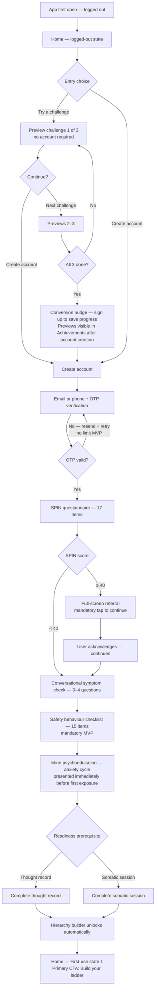
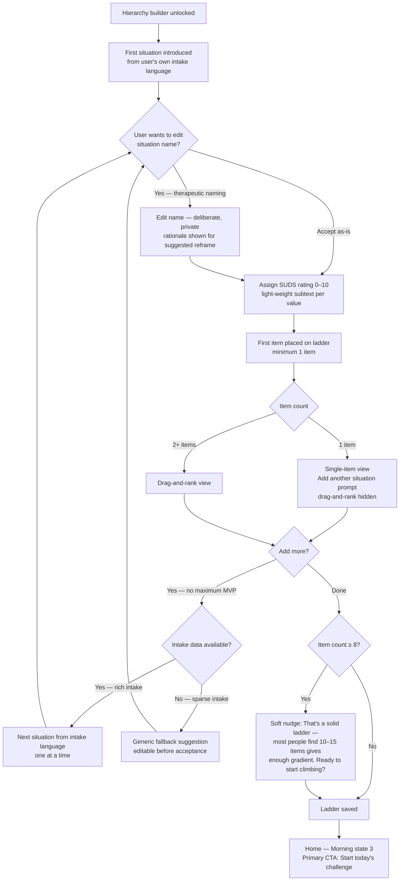
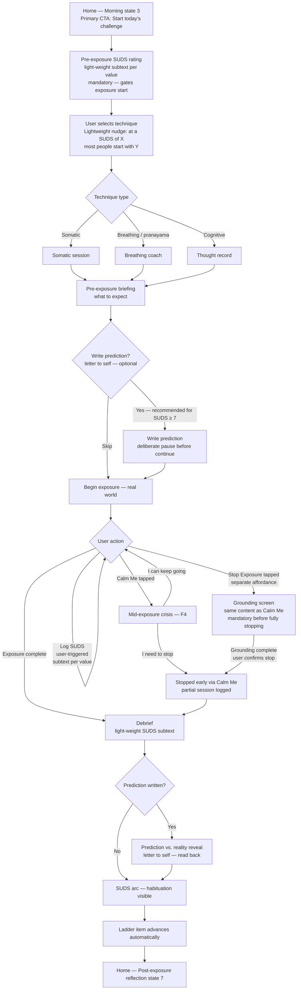
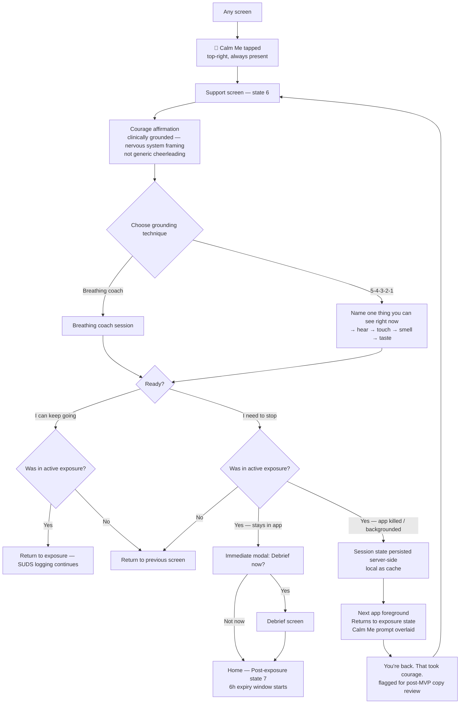
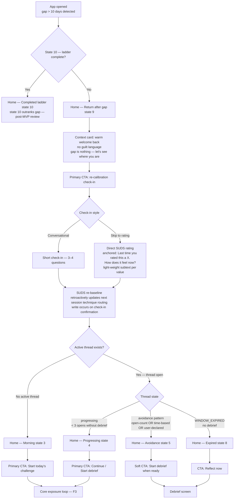
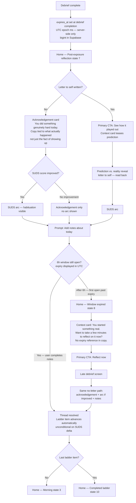

# UX Design Specification exposure-buddy

**Author:** Cooper
**Date:** 2026-05-08

---

<!-- UX design content will be appended sequentially through collaborative workflow steps -->

## Executive Summary

### Project Vision

exposure-buddy is a clinically grounded mobile app for social anxiety — built around a 5-phase therapeutic journey (Intake → Psychoeducation → Technique Protocol → Exposure Practice → Review) using CBT, ACT, Somatic, and Yoga/Indian Philosophy frameworks. It targets a global audience of adults experiencing social anxiety, with Indian philosophy and yogic techniques as a distinctive therapeutic lens. English MVP with architecture designed for future language and locale expansion from day one.

### Target Users

Adults globally experiencing mild-to-severe social anxiety. Smartphone-native. Likely self-referred as a first step — using the app before or alongside professional therapy. Carry significant shame around anxiety; the product must consistently signal safety and non-judgment. The Indian philosophical framing (lok-bhaya, pranayama, mantra anchoring) resonates across cultures when integrated functionally into technique — not used as aesthetic decoration. User range spans: first-time help-seekers who are easily frightened off, experienced self-help users who need fast paths past content they already know, and international users who bring varied cultural relationships with expressing distress.

### Key Design Challenges

- **Two parallel trust mechanisms** — At high-stakes moments (score reveals, severity gates, referral screens) users read carefully; copy must be precise and human. Across all other surfaces, trust is built through frictionless momentum — a flow so smooth the user never stops long enough to feel self-conscious. Both must be designed explicitly; neither substitutes for the other.

- **Score reveal as narrative, not number** — The SPIN score reveal leads with a plain-language summary of what the score means for this specific user. The number is secondary in visual hierarchy — context, not headline. Prototype with real anxious users before shipping.

- **Fear ladder: threshold, not locked door** — The readiness gate (D4) handles the clinical constraint. The UX challenge is making it feel like a natural, earned threshold — not a paternalistic barrier — so informed users move through quickly and anxious users feel prepared rather than blocked.

- **Fear ladder entry: conversation, not form** — Introduce one situation at a time from the user's own intake language. Full drag-and-rank view arrives after the first item is placed. Each AI question during ladder building has a legible clinical reason.

- **Situation naming as therapeutic act** — Ladder suggestions from intake are editable before acceptance. The act of naming a situation carefully is part of exposure preparation, not admin. Generic suggestions serve only as fallback for sparse intake responses.

- **Maintaining therapeutic alliance after a severity gate** — Post SPIN ≥40 referral acknowledgement, the app makes unambiguously clear it remains present and useful. A distinct interaction to design for, not a screen to design around.

- **Humanising the EX-3 stall protocol** — Silent rerouting, not announced failure. Replace "step back" with "spend more time here" across all copy. The ladder metaphor stays; the setback vocabulary changes entirely.

- **Technique mastery layer** — Once a technique has been used proficiently N times, it graduates to quick-access and the recommendation engine introduces something new. Time-based and mastery-based diversification prevents chronically elevated scores from trapping users in somatic-only monotony.

- **Progress must be delivered, not stored** — Design friction into the prediction vs. reality reveal; surface longitudinal progress at re-entry moments, not buried in a tab.

- **Localisation-ready from day one** — English MVP, but abstract beyond string length and directionality: date formats, number formatting, cultural norms around expressing distress.

- **Clinical scaffolding as invisible infrastructure** — No gamification, no streaks, enforced consistently across every surface.

- **Pull, not push, for re-engagement** — Push permission only after first completed technique. In-app re-entry design is the primary mechanism; notifications are a fallback, not the strategy. Narrow exception: a welfare-framed permission ask is permitted at post-score-reveal or post-first-technique — scoped explicitly to a single welfare check-in for users who go N days without opening the app. This must be framed as care ("May we check in if we haven't heard from you?"), not as engagement ("Get reminders to practice"). Engagement notifications remain gated behind first completed technique.

### Design Opportunities

- **Prediction vs. reality reveal as product hero moment** — Letter-to-self format: written before the exposure, read after. Pre-exposure writing gets its own dedicated screen with a deliberate pause before the continue button — unhurried, private. Design both success case (anxiety overestimated) and recovery case (anxiety confirmed) with equal care.

- **Fear ladder as therapeutic hero** — Drag-to-rank ERP hierarchy, introduced conversationally one situation at a time. Sequenced as an earned achievement. Setback language throughout: "spend more time here," never "step back."

- **Fear ladder as progress narrative** — At week 4 and 8 review, read back the user's own situation descriptions: *"When you started, these felt impossible. Here's where you are now."* The ladder becomes a record of courage, not just a clinical instrument.

- **Personalised ladder suggestions from user's own language** — The user's verbatim intake descriptions are the primary source for ladder suggestions — not a generic pre-populated list. Suggestions are editable before acceptance. Generic situations serve only as fallback for sparse intake responses.

- **Transparent and specific recommendation logic** — Surface the actual rule: "Your check-in score was 7, so we're starting with breathing." Never generic. The rule-based engine's specificity is the trust signal; opacity destroys it.

- **Technique before assessment — with explicit framing** — Lead with a single 2-minute breathing exercise before intake, framed openly: "Before we learn about you, let's give you something useful right now." Earns trust before asking questions; framing prevents the manipulative read.

- **Adaptive SPIN sequencing** — Start with 3 highest-signal questions; continue to all 17 only if early answers suggest moderate-to-severe range. Mild users get shorter intake without losing clinical accuracy where it matters.

- **Structured debrief with optional open text** — Keep minimal structured capture (SUDS slider + outcome tap) as core debrief. Open text field is optional elaboration — not a replacement. Prevents NLP misread from breaking trust.

- **Acknowledging courage independently of outcome** — Post-exposure debrief always recognises showing up, regardless of SUDS delta: *"You predicted this would be hard. It was. And you did it anyway."*

- **Technique mastery as quick-access graduation** — Proficiently used techniques move to a quick-access panel; the engine teaches something new. Mastery is celebrated, not ignored.

- **Therapist summary card, not just export** — Session data designed as a 90-second structured summary card readable before a clinical session, alongside raw export. Positions exposure-buddy as a therapeutic co-pilot from day one.

- **Crisis detection as emotional attunement** — Keyword system at lower sensitivity detects unusual session distress and offers a quiet welfare check without triggering the full crisis screen.

- **Welfare pause as third state** — Score 10 (or abandoned session) gets a distinct UX state: *"It sounds like today is really hard. You don't have to do anything right now. We're here when you're ready."* The welfare pause screen always displays a persistent, low-prominence crisis resource link — independent of keyword detection. The full crisis screen is keyword-triggered; the crisis link is always present at score 10. These are two distinct safety mechanisms and must not be conflated in implementation.

- **Cultural philosophy as functional USP** — Clinical mechanism always leads; cultural name follows. Every yogic/philosophy technique anchors in its clinical rationale before naming the tradition. Owned confidently in visual and copy language.

- **Experienced-user fast path** — Skips education, never clinical gates. Gates feel like achievements, not walls.

---

## Core User Experience

### Defining Experience

The core of exposure-buddy is a loop that spans time and real-world action: users prepare in the app, face a feared situation in the world, and return to reflect. The app's job is to hold that thread — before, during, and after — with the right presence at each moment.

The most frequent interaction is the daily check-in: 60 seconds, 3 taps maximum from app open to completion. The most critical interaction is the pre-exposure → exposure → post-exposure debrief loop, where clinical change actually happens. The loop is the clinical goal and the design framework; single-mode use — check-in only, in-the-moment only, or reflection without a prior thread — is the statistical norm. Each mode must feel complete in itself, never like an interrupted sequence.

### Three Usage Modes

**Preparation mode** — Before an exposure or technique session. Unhurried, intentional, supportive. Users are building readiness; the experience should feel like a ritual, not a checklist.

**In-the-moment mode** — During a real-world exposure. Instantaneous, one-tap, zero cognitive load required. Grounding tools, breathing exercises, and mantra recall must be reachable in under 2 seconds from anywhere in the app.

**Reflection mode** — After an exposure or session. Emotionally resonant, unhurried, narrative. The app receives what the user brings back from the world.

### Platform Strategy

**Mobile (primary — all three clinical modes):** iOS + Android via React Native + Expo. Touch-first. Offline-capable for all critical features: grounding tools, crisis helplines, fear ladder, mantra, and check-in history. Preparation mode, in-the-moment mode, and reflection mode are mobile-only — they require gesture interaction, haptics, local state continuity, and sub-2-second responsiveness that a shared web surface would compromise.

**Web (Day 1 — document-oriented surfaces only):** Onboarding on desktop, therapist summary dashboard, account management, and longer-form psychoeducation content. Document-oriented, low-interaction, tolerant of network latency. Web does not port the clinical modes.

**Architectural seam (non-negotiable):** Separate packages and explicit platform targets in the router config from day one. "Mobile-only" must be a defensible technical position, not a preference overrideable when someone asks "how hard can it be?"

**Two-layer design system:**

- **Layer 1 — Design language (fully shared):** Colour, typography, spacing scale, motion principles, emotional tone. Brand consistency across all surfaces.
- **Layer 2 — Interaction patterns (strictly separated):** Mobile interaction patterns owned by the mobile experience; web patterns owned by the web experience. They reference Layer 1 but share no components. No universal button.

**In-the-moment layer — zero web influence:** Pure React Native with no web polyfill dependencies. Grounding tool state cached locally on device boot. This surface is reviewed through one criterion only: *is this fast enough for a user at peak anxiety?*

**Accessibility gate:** In-the-moment components require explicit accessibility labels, VoiceOver/TalkBack reading order, and screen reader testing as a launch gate — not a post-launch audit. The breathing animation needs a live region announcing timing cues.

### Mode Transitions

The three modes map to real-world events that happen outside the app. Transitions are handled through three distinct mechanisms — never a single enforced sequence:

**Preparation → In-the-moment (explicit commitment):**
The pre-exposure prep screen ends with a deliberate **"Let's do this"** action — a distinct, intentional tap that marks the boundary between preparation and action, not a casual swipe or passive state change. The label is intentionally neutral in tone — accessible to users across the anxiety spectrum, neither projecting confidence nor passivity. The label is fixed for MVP; future versions may make this text dynamic based on user profile and situation type. On completion, the app shifts to in-the-moment standby: nav hidden, breathing room, quick-access panel prominent. An open thread is stored with the situation and timestamp. The app acknowledges the commitment with a brief moment of witness — not a silent state change. **Immediate second thoughts:** the in-the-moment standby screen includes a low-prominence exit affordance for users who change their mind in the seconds after tapping — no confirmation dialog, no explanation required. Returns to the preparation screen with the thread marked as not-yet-started.

**Any state → In-the-moment (always parallel, never gated):**
The in-the-moment quick-access layer is reachable from every screen via a persistent bottom panel element. It interrupts without replacing; on exit, the user returns exactly to where they were. This is the emergency path. It has no prerequisite and no gate. **Thread awareness:** when an open exposure thread exists, the in-the-moment layer surfaces a quiet ambient marker — *"You're heading to [situation]"* — so the user knows the app remembers. Not a prompt; does not appear when no thread is open. **Threadless micro-check-in:** when in-the-moment is invoked with no open thread (unplanned acute anxiety), a single optional prompt surfaces on exit — *"How are you feeling now? 1–10"* — closing the reflection loop for users who haven't yet built a ladder or committed to an exposure.

**In-the-moment → Reflection (thread memory, not automatic):**
On the next app open within the thread window, the app opens with a warm re-entry prompt: *"You were preparing for [situation]. How did it go?"* Four options:

- **"I did it."** → app asks: *"Want to talk about it, or just rate it?"* — giving the user control over depth of debrief
- **"I tried."** → app responds: *"That took courage. Want to share how it went?"* Partial exposure gets its own debrief path — not the full-completion flow, not dismissed as "not yet"
- **"I decided to wait."** → app responds: *"That's okay. It'll be here when you're ready."* Thread stays open. Clinically distinct from "Not yet" — flags deliberate avoidance to the recommendation engine rather than circumstantial delay. Multiple consecutive instances may prompt a gentle ladder review.
- **"Not yet"** → thread stays open; no pressure
- **"Rather not say"** → app responds: *"Got it. Take your time."* Thread closes. No second tap. No confirmation screen.

**Thread expiry:**
Thread window is **48 hours** from the "Let's do this" tap — long enough to survive a night's sleep and a full day of processing, reaching the morning-after reflection moment even for evening situations. After 48 hours without a debrief, the thread closes silently — no guilt message. If the user opens the app 3 or more days after an open thread expired, a light acknowledgement surfaces: *"It looks like some time has passed. No worries — your ladder is still here whenever you're ready."* The acknowledgement includes a single optional prompt — *"Did you end up going? Even a quick note helps."* — offering a brief retroactive debrief. Expired thread ≠ avoided exposure; this distinction matters for the recommendation engine. The prompt appears once, is fully dismissible, and does not reopen the thread.

**Concurrent threads:** A user may face multiple situations within a 48-hour window. The app enforces a single-active-thread rule: tapping "Let's do this" when a thread is already open prompts a single lightweight choice — *"You're still reflecting on [situation]. Close that first?"* — with one-tap resolution. The re-entry prompt always surfaces the most recently opened thread. Earlier threads queue and surface on subsequent app opens until resolved or expired. The single-active-thread rule is an MVP complexity constraint, not a clinical assertion — multiple simultaneous threads create ambiguous re-entry prompts, competing expiry timers, and unclear ladder position. Multi-thread support is a named future capability.

**6-week review gate:** The 48-hour window is a validated starting hypothesis, not fixed doctrine. Instrument thread completion rate and timing, silent expiry rate (segmented by time-of-day and day-of-week of the "Let's do this" tap), and 7/30-day retention for users with expired vs. completed threads. Review at 6 weeks with live data. Long-term direction is adaptive windowing anchored to tap time-of-day.

**Reflection → home:**
After debrief, the prediction vs. reality reveal appears as its own distinct screen — framed as curious, not comparative — before returning home. Home screen reflects updated ladder state and any celebration moment.

### Mode UI Signals

- **Preparation:** Full UI present. Navigation visible. Content-rich.
- **In-the-moment:** Stripped UI. Navigation hidden. Breathing room. Quick-access panel dominant. The app recedes — a tool in the hand, not a product to navigate.
- **Reflection:** Full UI returns. Soft warm tone. Progress elements surfaced. The app is a witness receiving what the user brings back.

### Effortless Interactions

- **Daily check-in:** 3 taps maximum from app open to completion
- **In-the-moment grounding — zero network dependency:** All assets pre-loaded on device boot. No network call on the critical path. Airplane mode = full functionality.
- **In-the-moment grounding — thumb-reachable:** Quick-access element in the bottom third of the screen — reachable in a natural one-handed hold on the smallest supported device. Minimum tap target 56×56px for all in-the-moment interactive elements; accommodates low-end and physically damaged screens common in the target demographic.
- **In-the-moment grounding — any screen, non-destructive:** Reachable from every screen without navigating away. Interrupts, doesn't replace. On exit, user returns exactly to where they were.
- **In-the-moment grounding — silent-mode primary:** Every technique fully functional with audio off. Breathing animation is the primary timing cue; audio is enhancement only.
- **In-the-moment grounding — accessible from cold install:** Available without intake, account setup, mantra, or fear ladder. Falls back to three universal techniques — must be explicitly specified before implementation (selection criteria: zero-instruction accessibility, no prior context required, proven efficacy at acute anxiety). Reachable in under 30 seconds from first install.
- **Crisis detection:** Completely invisible — pre-filters every message, zero user action
- **Mantra recall:** Shown automatically on the pre-exposure screen
- **Re-entry after a gap:** One orientation screen — where you are, what's next

### Critical Success Moments

- **The score reveal** — Narrative leads; number is context. User feels understood, not labelled.
- **The first completed exposure** — Received with weight, not processed like a form submission.
- **The first prediction vs. reality reveal** — The moment the user feels the app working. Framed as curious, not comparative.
- **The silent reroute** — A stall handled without announcement. Trust built by what the app doesn't say. Design constraint: silence is not blankness — the app must surface an updated forward path without labelling it a setback. The copy for this surface state is a required design deliverable before implementation.

### Experience Principles

1. **Clinical depth, human surface** — Clinically sophisticated; never feels like medical software.
2. **Three-mode presence** — Preparation, in-the-moment, and reflection each have a distinct visual and interaction register. The three modes are mobile-only by design.
3. **Progress delivered, not stored** — Insights reach the user at the right moment; they don't have to go looking for them.
4. **Safety gates are invisible unless they must speak** — Crisis detection and clinical gates run silently. When they do surface — welfare pause, severity gate — they are warm and non-clinical, never alarming.
5. **Earned access, never gatekeeping** — Clinical gates feel like achievements. Fast paths exist for informed users.
6. **Mobile-first, web-disciplined** — The design system has two layers: shared design language, separated interaction patterns. Web surfaces stay document-oriented. Mobile surfaces stay gesture-first.

---

## Desired Emotional Response

### Primary Emotional Goals

exposure-buddy is designed around a single emotional arc: users arrive feeling overwhelmed and unseen; they leave feeling transformed and quietly victorious. The product earns the right to that arc by being a trustworthy companion throughout — never a passive content library, never a clinical instrument.

**Understood and empowered** — the emotional baseline from first open. Users must feel the app *gets* what they're dealing with before they're asked to do anything hard.

**Companion trust** — the sustained emotional quality across the journey. The app is something users rely on, not something they consult. This is the feeling that differentiates exposure-buddy from every other anxiety app they downloaded and deleted.

**Victory and transformation** — the emotional destination. Not just relief, not just reduced symptoms — a felt sense of having done something genuinely hard and come out the other side different.

---

### Emotional Journey Mapping

**Discovery / First open (0–30 seconds)**
Relief that something like this exists. Curiosity about what it does differently. Cautious hope that this time might be different. All three simultaneously — the product should honour the complexity of that first moment rather than oversimplifying it into a single pitch.

**During the hard moments** (SPIN score reveal, first ladder view, referral screen)
Encouraged and informed. The user leaves these moments knowing more than they did, feeling that the app handled the moment well — not overwhelmed, not dismissed. Steady is the right word: the app holds its ground so the user doesn't have to.

**When something goes wrong** (stalled exposure, high SUDS, bad session)
The app stays present. Users in distress cannot self-optimise their way out — the emotional job of the app in these moments is to be the companion that hasn't left. "I'm still here" is the primary signal; "let's try again" is secondary and comes only when the user is ready.

**Returning after a break**
Warm welcome back. No guilt, no performance review. Forward-looking — the next step is visible and accessible without ceremony. All three tones simultaneously: warmth, acceptance, momentum.

**The ask to face something hard**
A firm but kind friend who genuinely understands what they're going through, and is quietly confident they can do it. Not cheerleading. Not clinical instruction. The app brings the same energy a good friend would: steady, honest, not minimising — and fundamentally believing in the person in front of it. *Note: the specific tone of this ask is a candidate for future personalisation by user profile.*

---

### Micro-Emotions

The app leans predominantly toward **confident, proud, and momentum-building** — but not uniformly. Deliberate pockets of patience matter.

| Moment | Primary Emotion | Texture |
|--------|-----------------|---------|
| Pre-exposure preparation | Quiet confidence | "You've prepared for this" |
| Technique in progress | Patient, unhurried | "Take all the time you need" |
| Completing an exposure | Pride — understated | Quiet recognition, not high-five |
| Score reveal | Steady, informed | Encouraged, not overwhelmed |
| Setback / stall | Companioned | "We're still here" |
| Re-entry after gap | Warm acceptance | No guilt, forward-looking |
| Mastery achievement | Surprised delight | Moment of unexpected recognition |
| First prediction vs. reality reveal | Curious wonder | Framed as discovery, not evaluation |

---

### Design Implications

**"Understood and empowered" → Precision copy at every trust-critical moment.** The emotional goal requires the words to be exactly right — not warm-but-vague, not clinical-but-accurate. Both. Score reveals, referral screens, and ladder introductions are where this is most load-bearing.

**"Companion trust" → Consistent presence, not intrusive helpfulness.** The app doesn't over-explain or over-prompt. It shows up reliably, holds state across sessions, and remembers what the user told it. Amnesia — the app forgetting context it should know — is the fastest way to break companion trust.

**"Victory and transformation" → Progress must be surfaced, not stored.** Longitudinal progress doesn't live in a tab. It appears at the right moment — re-entry, week 4 review, prediction vs. reality reveal — delivered as narrative, not metrics.

**"Firm but kind friend" → Consistent voice across all copy.** The app's emotional register should be stable. Not warmer in celebration, not cooler in clinical moments. The friend doesn't change personality based on what's happening — and neither does the app.

**"Take all the time you need" pockets → Deliberate pacing design.** Certain screens should have built-in patience: pre-exposure writing (unhurried pause before continue), technique sessions (no time pressure), post-bad-session (no forward nudge). These are explicit design states, not defaults.

**"Quietly confident" → Avoid projection.** The app believes in the user but doesn't project emotions onto them. "You can do this" is a tone, not a line. The copy never tells users how they feel — it reflects what it observes and offers what might help.

---

### Emotional Design Principles

1. **Arc over moment** — Every individual screen serves the larger emotional journey from understood → victorious. No screen is emotionally neutral.

2. **Companion, not coach** — The app is present and reliable, not directive. It offers; users choose. The voice is a friend who has done their research, not a clinician who has a protocol.

3. **Confidence as default, patience as punctuation** — The dominant register is forward-moving and capable. Deliberate pauses are placed at specific moments as punctuation — not as the baseline tone.

4. **Recognition over celebration** — Quiet, specific recognition of what just happened outweighs generic celebration. *"You predicted this would be hard. It was. And you did it anyway."* — not a confetti animation.

5. **Presence over reassurance** — When things go wrong, the emotional job is to stay present, not to reassure. Reassurance that rings false at a hard moment does more damage than silence.

6. **Earned transformation** — The sense of victory at the end of the journey is real because the hard moments were not minimised. The app's emotional honesty during difficulty is what makes the transformation feel true.

---

### Post-MVP Refinements (TBD)

The following areas were surfaced during design review and deferred to post-MVP:

- **Time-aware companion register** — "I'm still here" as a uniform response fails time-pressured pre-event distress (e.g., 8:47am before a presentation). The companion voice needs a stakes-calibrated register: grounding and action-oriented before an imminent event, present and witnessing after. Requires instrumentation to detect time-pressure context.

- **Shame-of-prior-failure as arrival state** — The first-open arc assumes cautious hope. The high-value returning user arrives carrying shame from prior failure. The copy needs to quietly dissolve the specific fear that avoidance is character, not behaviour — before the first question is asked.

- **Re-entry diagnostic branching** — "You were just busy" and "last time was hard" require different companion tones on re-entry. Route on behavioural data (last session length, reflection filed, mid-session abort) before prompting.

- **Witnessed vs. passive presence** — In the 20-minute window after a bad exposure, "I'm still here" is insufficient without specificity. The companion must reference what actually happened: *"You stayed 40 minutes longer than your last exposure. That's real."* Generic presence reads as absence.

- **Adversarial user state** — No current register for "this isn't working after 12 exposures." The companion voice for this moment is: stay curious, not defensive. "Yeah. It's slow. What happened at the last party?" — not reassurance, not preaching.

- **Non-completer emotional design** — 60–80% of users in this category drop off by week 4 without a dramatic incident. The arc has no emotional design for the quietly-sliding user. An *honest checkpoint* pattern is needed: "Here's what your data shows. Here's what we'd expect to see if this is working. You're the one who knows which is true."

- **Therapist-referred first-open arc** — Referred users arrive with a delegated, observed emotional posture — not self-chosen curiosity. A branching first-open tone that signals "you chose to be here" without asking directly.

- **Companion trust at monetisation touchpoints** — Renewal prompts landing during stall/gap periods, especially after a bad exposure, break the companion frame. Gate renewal communications against emotional state.

- **Proxy metrics for "steady"** — Instrument: predicted-vs-rated difficulty delta, re-entry latency after hard exposures, companion prompt dismissal rates correlated with completion rates.

- **Companion's honest limit** — No current design for the moment a user stops believing the product can help them. The companion needs a voice for: *"Some people need more than this app can provide"* — without abandoning them in that moment.

- **Cultural and shame-encoding variance** — "No guilt, forward-looking" encodes individualist recovery norms. Review re-entry copy for collectivist users (South Asian, East Asian, Latin American segments particularly relevant given Indian philosophy framing). Scope: do not actively harm; deep adaptation is a later phase.

- **Acute distress escalation path** — "Presence over reassurance" has no escalation mechanism. The companion needs to know when to step aside: *"I'm here, and I think you should call someone."* Requires clinical advisory and legal boundary definition before implementation.

---

## UX Pattern Analysis & Inspiration

> **Review status:** Saved for post-MVP review. Patterns are directionally correct but require validation against live user data, clinical referral channel stakeholder input, and avoidance-moment usability testing before being treated as settled design direction.

### Inspiring Products Analysis

**Calm — Relaxing UX, The Daily Series**

Calm solves two problems simultaneously. First, the ambient experience — typography, colour, sound, pacing — is itself the product before any content begins. The app feels like a decompression chamber: entering it is a calming act in itself. Second, the Daily series eliminates decision fatigue for returning users. One pre-selected action surfaces today. The container is familiar; the content refreshes. Users don't choose — they show up and the app has already prepared something for them.

*Critical distinction for exposure-buddy:* Calm's ambient entry works because the user's job is to receive — sit, listen, decompress. Exposure-buddy users are not passive recipients; they are being asked to approach something frightening. The adaptation is consequential: the entry must be warm and containing, but with quiet forward momentum — not "you're here, you're safe, breathe" (spa), but "you're here — let's see what today holds" (dojo). The act of opening is the threshold before the accomplishment, not the accomplishment itself.

**Apple Fitness — Gentle Nudges, Awards and Challenges**

Apple Fitness's achievement system is notable for what it doesn't do: it doesn't punish absence. Rings reset daily; closing them is an invitation, not an obligation. Awards mark real thresholds — first workout, longest streak — and feel genuinely earned. Challenges have a short time horizon that creates momentum without long-term pressure. Nudges are ambient: a notification, a ring percentage — never a guilt mechanism.

*Note:* The emotional register of Apple Fitness recognition is calibration-focused ("you did 5 workouts"). For exposure-buddy, recognition must also name the courage underneath the number: "You kept showing up when it was hard." Clinical warmth, not generic celebration.

**Wysa — Anonymity During Initial Steps**

Wysa's defining UX decision is to delay identity until after value has been delivered. Users can explore, engage, and begin a session before any account is required. This directly reduces the shame activation that occurs when a mental health app asks "who are you?" before it has earned the right to ask. The no-account state doesn't feel limited — it feels like a complete, safe first experience.

*Boundary for exposure-buddy:* The pre-identity value must be psychoeducation and light somatic tools — not exposure practice. Cold-install exposure without clinical calibration risks flooding the user and producing the conclusion that the therapy doesn't work. The value delivered before identity must be genuinely useful and genuinely safe.

---

### Transferable UX Patterns

**Containing Entry with Forward Momentum (adapted from Calm)**
The opening experience is warm and safe, but not passive. It holds the user without asking them to arrive already calm. The ambient register functions as the first therapeutic gesture — but its emotional quality is readiness, not relaxation. "You're here — let's see what today holds."

**Context-Sensitive Daily Action (adapted from Calm — Daily series)**
One pre-decided action is surfaced at home screen entry — no browsing, no menu, no decision. But the action is inferred from the user's phase in the journey, recency of engagement, and last session outcome — not a static daily default. Day 3 after a social failure surfaces differently from a recovery day. The framing and stakes of the action shift tonally across the 5-phase therapeutic journey. The decision is pre-made; the decision logic underneath is clinical.

**Threshold Recognition as Clinical Safety, Not Just UX (from Apple Fitness)**
Streak mechanics are a clinical contraindication for shame-sensitive populations, not merely a gamification preference to avoid. Missing a streak day triggers an abstinence violation effect — a collapse in self-efficacy that can be worse than never starting. Threshold recognition fires at real milestones; gaps don't erase progress. Recognition names the courage in the threshold, not just the completion.

**Ambient Progress at Re-entry Moments (from Apple Fitness)**
Longitudinal progress is delivered at the right moment — re-entry, week 4 and 8 review, prediction vs. reality reveal — not stored in an analytics tab for the user to find. Progress surfaces as narrative, not metrics.

**Value-Before-Identity Onboarding (from Wysa)**
Grounding tools are accessible from cold install — before intake, before account creation, before the fear ladder exists. Pre-identity value is scoped to psychoeducation and light somatic tools. The app earns trust through usefulness before asking anything personal.

**Discreet UI for Shared-Device Contexts (from Wysa)**
Particularly relevant for South Asian family structures and other collectivist user segments: the UI should not expose therapeutic content to casual device observers. Discreet exit affordances and non-revealing home screen states protect the user's privacy not just from the app, but from their environment.

---

### Original Patterns (No Reference App Provides These)

**Compassionate Re-entry Without Shame Activation**
Users who return after avoidance — a week gap, an abandoned exposure, a hard session they fled — are the highest-need users and the ones most likely to feel they have already failed. The re-entry experience must feel like a companion who stayed, not a system logging a return. No performance review. No count of missed days. A warm, specific acknowledgement of where they are, and one clear forward path.

**Avoidance-Moment UX**
The moment of maximum resistance — when the user needs to do an exposure and is looking for any reason not to — is not addressed by any reference app. Calm, Fitness, and Wysa all assume forward momentum. This moment must be designed from first principles: holding activation alongside safety, acknowledging that discomfort is the mechanism rather than a problem to be solved, and offering presence rather than an easy exit.

---

### Anti-Patterns to Avoid

- **Streak mechanics** — clinical contraindication (abstinence violation effect), not merely a gamification preference
- **Passive ambient entry** — risks making the act of opening the app feel like the accomplishment, feeding avoidance
- **Decision menus at entry** — forces choice when users are most depleted; one clear action, already decided
- **Identity gates before grounding tools** — activates shame before earning trust
- **Exposure practice before clinical calibration** — cold-install exposure risks flooding; pre-identity value must be light somatic tools and psychoeducation only
- **Generic celebratory tone at emotionally complex moments** — recognition must be quiet, specific, and courage-naming
- **Progress buried in analytics tabs** — longitudinal progress must be delivered at the right moment, not stored

---

### Design Inspiration Strategy

**Adopt directly:**
- Threshold recognition with courage-naming (Apple Fitness mechanics, clinical framing)
- Value-before-identity onboarding scoped to psychoeducation + light somatic tools (Wysa)
- Ambient progress delivery at re-entry and review moments (Apple Fitness)
- Discreet UI for shared-device contexts (Wysa)

**Adapt significantly:**
- Calm's ambient entry → containing + forward-momentum entry (dojo, not spa)
- Calm's pre-decided daily action → context-sensitive daily action inferred from phase, recency, and last session outcome
- Apple Fitness recognition → threshold recognition with courage-naming, not completion-counting

**Invent (no reference exists):**
- Compassionate re-entry without shame activation
- Avoidance-moment UX (activation held alongside safety; discomfort as mechanism)

**Avoid:**
- Streak mechanics (contraindication, not preference)
- Passive ambient entry
- Decision menus at home screen
- Identity gates before value
- Exposure before clinical calibration
- Generic celebration at emotionally complex moments

---

## Design System Foundation

> **Architecture constraint:** This section operates within ADR-001 (closed). NativeWind `5.0.0-preview.3`, Turborepo + pnpm, and the `packages/ui` boundary are resolved decisions — not open questions. No content here reopens those ADRs.

### Design System Choice

**NativeWind `5.0.0-preview.3` (Tailwind CSS v4) via `packages/ui`**

The design system is built on the styling architecture already resolved in the system architecture document. `packages/ui` is the shared component and token package. All design tokens, primitives, and composed clinical components live here. The two-layer design language is expressed through NativeWind v5 class conventions shared across platforms — with platform-specific interaction patterns handled at the component level.

| Layer | Location | Purpose |
|-------|----------|---------|
| Shared design language | `packages/ui/src/tokens/theme.ts` | Colour, typography, spacing, motion, haptics — typed TS constants mirroring CSS custom properties |
| Mobile primitives | `packages/ui/src/primitives/` — NativeWind v5 styled | Button, Text, Input, Card — gesture-first, accessible |
| Mobile composed | `packages/ui/src/composed/` | SudsScale, ProgressChart, CrisisCard — clinical UI compositions with mode-conditional behaviour |
| Web components | `apps/web` — Phase 2 placeholder | Web design system deferred; `apps/web` contains no active stack at MVP |

> **Phase 2 web transition:** When `apps/web` activates, `packages/ui/src/tokens/theme.ts` is the starting point for web token expression via Tailwind CSS v4. Do not backport mobile clinical component behaviour to web without a dedicated UX session.

**NativeWind v5 / Tailwind CSS v4 note:** NativeWind v5 uses a CSS-first configuration model — CSS custom properties rather than the `tailwind.config.js` JS object approach of v3. Token definitions, theme extensions, and class references must use the v5 API. Version pinned to exact: `nativewind@5.0.0-preview.3`. Review required at each preview bump before upgrading.

---

### Rationale for Selection

**Architecture-resolved, not design-system-chosen.** NativeWind v5 is a closed ADR decision. The design system's role is to document how to use it well — not whether to use it.

**Two-layer architecture expressed through NativeWind v5.** The shared design language (colour, typography, spacing, motion) is expressed as Tailwind class strings that work identically on mobile via NativeWind v5 and will work on web via Tailwind CSS v4 at Phase 2. Platform-specific layers handle where that abstraction breaks down.

**`packages/ui` import boundary (from architecture).** This package may import from `packages/core` (types only). Forbidden: `packages/sync`, `packages/supabase`, RN platform APIs. Enforced by `packages/ui/.eslintrc.js` in CI.

**Raw Tailwind bypass prohibited in composed components.** All colour and spacing values in `packages/ui/src/composed/` must reference design tokens — not raw Tailwind utility values (`bg-blue-500`, `p-4`). Raw utility values applied without token indirection violate the mode register system and produce clinical surfaces that look correct but feel wrong. This constraint is written into the spec now; a lint rule enforces it when the package is built.

**StyleSheet as escape hatch, not primary.** NativeWind v5 class resolution is the canonical styling path. `StyleSheet` is used for: animated components (Reanimated requires StyleSheet or worklet values), imperative style calculations, and edge cases where NativeWind v5 pre-release behaviour produces unexpected results on a specific platform. StyleSheet usage outside these cases is flagged in code review.

**rn-primitives + @gorhom/bottom-sheet evaluated in Phase 0.** Before building scratch components, evaluate `react-native-reusables` (rn-primitives, NativeWind-native, accessible) and `@gorhom/bottom-sheet` (Gesture Handler-based, Expo-compatible). Written decision memo required. Time-boxed to 1 day.

---

### Token Architecture

**Single source: `packages/ui/src/tokens/theme.ts`**

Tokens are typed TypeScript constants that serve two consumers: NativeWind v5 theme extensions (CSS custom properties → utility classes) and imperative TypeScript (animations, haptic timing, StyleSheet fallbacks).

```typescript
// packages/ui/src/tokens/theme.ts (illustrative structure)
export const color = {
  surface: { primary: 'var(--color-surface-primary)', ... },
  content: { primary: 'var(--color-content-primary)', ... },
  mode: {
    preparing: { background: 'var(--color-preparing-bg)', ... },
    grounding: { background: 'var(--color-grounding-bg)', ... },
    reflecting: { background: 'var(--color-reflecting-bg)', ... },
  },
} as const

export const motion = {
  preparing:  { duration: 200, easing: 'ease-out' },    // forward-leaning, slight urgency
  grounding:  { duration: 400, easing: 'ease-in-out' }, // anchoring stillness
  reflecting: { duration: 600, easing: 'ease-out' },    // unhurried, retrospective
} as const

export const haptic = {
  breathingRhythm:      'light',    // repeating during breathing exercise
  dragConfirmation:     'medium',   // fear ladder item placement
  commitmentTap:        'heavy',    // "Let's do this" — distinct, weighted
  techniqueCompletion:  'success',  // custom pattern on completion
} as const

export const spacing = { ... } as const
export const typography = { ... } as const
```

Motion preset values are locked to the clinical requirements: `motion.grounding` at 400ms ease-in-out reflects the anchoring quality of an in-the-moment intervention. These values are not aesthetic choices — they encode the mode register and must not be overridden at the component level without a design review.

Haptic constants are semantic labels mapping to `expo-haptics` impact levels. Tested on physical device — simulators do not support haptics.

---

### Composed Component Behavioural Contracts

Mode-conditional behaviour is specified here, not left to per-component engineering judgment.

| Component | In-the-moment register | Reflection register | Preparation register |
|-----------|----------------------|--------------------|--------------------|
| `CrisisCard` | **No mount animation.** Motion is contraindicated during dysregulation. Instant render only. | Gentle fade-in (`motion.reflecting`) | Not used in this register |
| `SudsScale` | **Reduced motion mandatory.** Haptic feedback on value change (`haptic.dragConfirmation`). No decorative animation. | Standard interaction, `motion.reflecting` | Standard interaction, `motion.preparing` |
| `ProgressChart` | Not used in this register | Full animation (`motion.reflecting`) | Summary view, `motion.preparing` |

**In-the-moment zero-network guarantee (design layer):** Composed components used in the in-the-moment register must not contain conditional rendering based on network state — no loading skeletons, no optimistic UI patterns, no connectivity-dependent branches. This is a design-layer guarantee, not solely an architecture-layer guarantee. Violation of this constraint in a PR is a blocking issue, not a comment.

**In-the-moment render budget:** The 2-second access requirement from anywhere in the app is a performance contract. Design system implications: in-the-moment components carry no lazy-loaded assets, no deferred fonts, no first-render network calls. Animation frame budget for the in-the-moment layer: 16ms/frame (60fps) on a 2GB RAM Android 10 device. If NativeWind v5 pre-release introduces jank on this surface, StyleSheet is the approved escape hatch — flag in code review with the performance reason.

---

### Implementation Approach

**Phase 0 — Pre-work (before any component in `packages/ui` is built)**

1. **NativeWind v5 validation:** Verify `nativewind@5.0.0-preview.3` on target devices (2GB RAM Android 10+, iOS 16+). Check: dark mode through native modals, CSS custom property resolution on Android, hot reload with Expo Router v4. Document results. Hard blocker → ADR revision, not a design system workaround.

2. **Library evaluation (1 day, time-boxed, written decision memo required):**
   - `react-native-reusables` / `rn-primitives` — adopt / reject / partial adopt with specific components
   - `@gorhom/bottom-sheet` — adopt / reject (fear ladder panel, detail sheets)
   - `react-native-gesture-handler` — confirm Expo SDK 54 compatibility

3. **`packages/ui/src/tokens/theme.ts` authored** — complete token set before any component work.

**Phase 1 — Mode design briefs (pre-sprint-1 gate, PM-owned)**

One-page director's brief per mode, written before any component is built. This is a writing task, not a design task — no designer required. Owned by the PM or founding team. Sprint 1 does not begin until all three briefs exist. The gate is enforced at sprint planning, not left to engineering judgment.

- **Preparation:** Warm, containing, quiet forward momentum. Dojo, not spa.
- **In-the-moment:** Stripped. Immediate. Zero overhead. The app recedes to a tool in the hand.
- **Reflection:** Unhurried. Retrospective. Slightly slower. The app witnesses.

Haptic language per mode specified here. Implementation via `expo-haptics`. Physical device testing required.

**Phase 2 — `packages/ui` components (clinical priority order)**

1. In-the-moment grounding tools — **prototype-gate** (see below)
2. Daily check-in primitives
3. Fear ladder / hierarchy components
4. Avoidance-moment screen — **prototype-gate** (see below)

**Prototype gates:** The in-the-moment and avoidance-moment screens cannot enter an implementation sprint without a tested prototype. The prototype does not require professional tooling — a Figma prototype, a React Native sketch, or even a paper walkthrough with a user who has social anxiety qualifies. The PM owns the gate decision: the PM signs off that the prototype has been tested and the interaction has been felt before code begins. This is not a bureaucratic step — it exists because these surfaces cannot be assembled from components correctly without first being experienced.

**Accessibility requirements belong in ticket acceptance criteria**, not only in PR checklists. Every ticket that produces an in-the-moment or composed component includes these as written AC:
- `accessibilityRole`, `accessibilityLabel`, `accessibilityState`, `accessibilityHint` set explicitly
- Minimum 44×44pt touch target
- VoiceOver/TalkBack reading order tested on physical device
- Haptic pattern specified and implemented
- Tested with audio off

The PR checklist is a secondary reminder, not the primary enforcement mechanism.

**Phase 3 — Web design system (Phase 2 project)**

`apps/web` activates at Phase 2. Web design system choice (shadcn/ui or otherwise) is a Phase 2 decision. `packages/ui/src/tokens/theme.ts` is the starting point for web token expression at that point.

---

### Failure Prevention

| Risk | Trigger | Prevention |
|------|---------|------------|
| NativeWind v5 pre-release regression | Preview bump | Pin to exact version; run Phase 0 validation before any upgrade; ADR revision if hard blocker |
| Raw Tailwind values bypass token system | Developer reaches for `bg-blue-500` in composed components | Written constraint in spec; lint rule at build time |
| Mode registers converge | No mode briefs before component work | Mode briefs are pre-sprint-1 gate; PM-owned; enforced at sprint planning |
| CrisisCard animated in in-the-moment | Animation added without mode-conditional check | Behavioural contracts table in this doc; PR checklist item: "mode register verified" |
| In-the-moment network dependency introduced | Loading state added to grounding component | Zero-network annotation is a blocking PR issue; no conditional network renders in in-the-moment components |
| Prototype gate bypassed | Timeline pressure | PM owns the gate; it is a sprint planning gate, not a code review gate — cannot be waived post-implementation |
| Haptic spec never shipped | Not in sprint | Haptic constants in `theme.ts` make it visible in the token file; AC on every in-the-moment component ticket |
| rn-primitives evaluation skipped | Sprint starts before Phase 0 | Named deliverable with 1-day time-box and required written memo |

---

### Contingency Paths

| Scenario | Trigger | Path |
|----------|---------|------|
| NativeWind v5 hard blocker on target device | Phase 0 validation fails | ADR revision required; StyleSheet + typed constants from `theme.ts` as fallback; architecture team sign-off before proceeding |
| rn-primitives partial coverage | Missing gesture / sheet patterns | Hybrid: rn-primitives for accessibility primitives; @gorhom/bottom-sheet for panels; from-scratch only for bespoke interactions |
| Haptic spec deprioritised | Not scoped into sprint | Haptic constants in `theme.ts` make it visible; component PR checklist enforces it as a merge gate |
| Designer joins post-MVP | Onboarding to undocumented system | `theme.ts` commented with the why behind each token value; mode briefs stored at `docs/design/modes/`; Phase 0 decision memos at `docs/design/adr/` |
| In-the-moment jank on 2GB RAM Android | NativeWind v5 frame budget exceeded | StyleSheet escape hatch approved for this surface; flag in code review with performance measurement |

---

## Defining Experience

### Defining Experience Statement

> "You build your courage ladder — a personal list of social situations you want to face, ranked from manageable to challenging. You face them one at a time. The app holds your thread before, during, and after. The ladder grows as you climb it."

### User Mental Model

Users arrive with a **to-do list** mental model — they know what they're avoiding and have a rough sense of what would be "easier" or "harder." The ERP hierarchy concept is clinically familiar but experientially foreign. The courage ladder must feel like an organically grown personal record, not a clinical instrument.

**What they bring:**
- A working sense of their own anxiety gradient — they know some situations are harder than others, even if never formally articulated
- Previous app failure experience — the shame of downloading and abandoning prior mental health apps is a live presence at first open
- Avoidance as identity — *"I'm just a shy person"* is the dominant self-narrative; the ladder must reframe avoidance as behaviour, not character

**Where confusion enters:**
- Abstract SUDS scales without anchoring language — first rating is a guess without context
- "Upcoming events" vs. "ongoing patterns" — first-situation prompt must honour both
- "What counts as an exposure?" — commitment-resistant users need a lower-threshold entry path

**Current solution failures:**
- Therapist homework sheets: effective but disconnected from real-time
- Generic anxiety apps: calming tools, no exposure structure
- Paper journals: private, no feedback loop

### Success Criteria

| Criterion | Notes |
|-----------|-------|
| First situation feels earned, not assigned | "Suggest" as fallback; guided first-situation prompt with corrected language |
| Full ladder view is satisfying, not clinical | A map of courage, not a checklist |
| "Let's do this" tap feels weighted | Ritual gravity; heavy haptic |
| Return after exposure feels received | Debrief is a conversation; five paths |
| Progress reads as narrative | *"You said this would be impossible. You've done it twice."* |
| SUDS slider makes intuitive sense on first use | Anchoring language shown before first interaction |
| Stuck users find a forward path | Alternative paths when avoidance pattern detected |
| Single-item ladder feels complete, not broken | Warmth state shown; drag-to-rank appears only at 2+ items |
| Commitment ritual feels intentional without a mantra | Mantra slot hidden (not empty) until set |

### Novel vs. Established Patterns

**Borrowing (familiar):** Drag-to-rank, free-form text entry, progress indicators, thread re-entry prompts.

**Inventing (no reference):**
- Conversational ladder building from the user's own intake language
- Courage ladder as narrative artifact — reads backwards at review to surface the gap between "impossible then" and "done now"
- "Let's do this" commitment ritual with emotional weight — distinct from a navigation tap
- Return debrief thread — app remembers context across a real-world gap and receives the user back
- Sub-exposure / "just observe" path — lower-commitment entry; assess for MVP inclusion in implementation sprint (≤1 sprint = include; otherwise post-MVP)

### Experience Mechanics

#### Naming

The feature is named **"courage ladder"** throughout — never "fear ladder," never "exposure hierarchy." Every surface: copy, tooltips, progress readbacks.

#### Adding Situations

**First situation (guided prompt):**
*"Think of one social moment that feels hard for you — it could be something coming up, or something you face regularly."*

- Includes both upcoming events and ambient/recurring anxiety
- Specific moment framing ("one social moment"), not category framing
- **"Suggest" button**: 3–5 templates drawn from the user's intake language (verbatim preferred; generic templates as fallback for sparse intake)
- All suggestions editable before acceptance — naming a situation carefully is therapeutic preparation

**Single-item ladder state:**
When only one situation exists, the ladder view shows a warmth state: *"Your first situation is on the ladder. Add a second to begin ranking."* Drag-to-rank appears only when 2+ situations exist.

**Ongoing addition:**
"+" always accessible throughout the app — not gated to a dedicated flow.

#### Ranking

- **Pairwise comparative ranking** at entry: *"Is this easier or harder than [adjacent situation]?"*
- Maximum 3 comparisons per new addition (bisection algorithm) — prevents ranking fatigue
- Full **drag-to-rank view** available when 2+ situations exist
- `float rank_score` (fractional indexing) stored — not cardinal integers — to avoid row rewrites on edit/delete

#### Commitment Ritual

Preparation screen:
- **Mantra**: hidden (slot not rendered) until the user has set one; appears progressively once set. The ritual feels intentional and complete without it on day 1.
- **SUDS prediction slider** — anchoring language shown before first interaction: *"0 = no anxiety, 10 = worst imaginable. Most people land between 4–7."* Displayed as inline tooltip or brief onboarding moment on first use.
- **Optional pre-exposure writing field** — unhurried; deliberate pause before the continue button activates
- **Deliberate pause** before "Let's do this" becomes active
- **Heavy haptic** on tap — distinct, weighted; marks the boundary between preparation and commitment

`situation_text_snapshot TEXT` — written at "Let's do this" tap. This is the canonical commit moment and the correct snapshot for historical narrative readback. Do not FK-join the mutable `situations` table for this purpose.

SUDS prediction written to Supabase at prep-screen exit (crash-safe — not at "Let's do this" tap).

**Sub-exposure / "Just observe" path (scope TBD at implementation sprint):**
A lower-commitment entry for commitment-resistant users — engages with the exposure situation without the full ritual. If ≤1 sprint effort at implementation, include in MVP. Otherwise post-MVP.

#### Five Debrief Return Paths

1. **"I did it."** → *"Want to talk about it, or just rate it?"* — user controls depth of debrief
2. **"I tried."** → *"That took courage. Want to share how it went?"* — partial exposure; its own path, not dismissed
3. **"I decided to wait."** → *"That's okay. It'll be here when you're ready."* — flags deliberate avoidance to recommendation engine
4. **"Not yet"** → thread stays open; no pressure — circumstantial delay; clinically distinct from path 3
5. **"Rather not say"** → *"Got it. Your ladder is here whenever you're ready."* — explicit forward reference; thread closes; no second tap. Silently sets `welfare_flag = true` on the thread record. Recommendation engine next-day action: surface a low-pressure grounding technique, not a ladder challenge.

#### Thread Management

- **48-hour thread window** from "Let's do this" tap (server-authoritative timestamp)
- **State machine:** `IDLE → PREPPING → COMMITTED → [RETURNED | WINDOW_EXPIRED | ABANDONED]`
  - `WINDOW_EXPIRED` = 48hr elapsed with no debrief (system-triggered)
  - `ABANDONED` = explicit user tap to close thread (user-triggered)
  - Recommendation engine treats both identically for MVP; states distinguished in data for future analysis
  - `WINDOW_EXPIRED` re-entry behaviour: deferred to post-MVP (TODO)
- Offline: client reads `expires_at` from last sync; reconcile on reconnect

#### Prediction vs. Reality Reveal

**Success case** (actual SUDS < predicted): quiet recognition of the gap. Achievement message + motivational prompt + *"What would you like to try next?"*

**Hard case** (actual SUDS ≥ predicted) — sequence is clinically ordered:
1. **Grounding offer first**: 2–3 curated somatic/grounding exercises (breath-holding techniques excluded — contraindicated for panic disorder; somatic/grounding exercises first)
2. **Deliberate pause** — no auto-advance; user controls when to proceed
3. **Optional reflection**: SUDS rating tap → optional writing field
4. Neutral framing throughout: *"That was hard. And it's okay — there's no wrong result here. The important thing is you tried."*

Both cases include achievement message and motivational prompt.

#### Rolling Average Anxiety Nudge

- Track rolling average SUDS with **exponential decay recency weighting** — half-life = 14 days; minimum 3 check-ins required before any nudge fires
- After gap > 7 days: prompt *"How are you feeling today?"* re-calibration check-in before surfacing any nudge — do not assume prior average is current
- **Clinical safety rule**: if recency-weighted average ≥ 6 AND no exposures completed in past 14 days → nudge switches to grounding technique or ladder downward review invitation; do not surface a new challenge
- **Standard path** (no stuck pattern, no high-average block): nudge with one ladder challenge near the recency-weighted average
- **Stuck pattern detection**: N = 3 app opens with active ladder + X = 7 days zero commitments → replace nudge with alternative path: technique session, psychoeducation revisit, or invitation to adjust ladder downward. Starting hypotheses; instrument and review at 6 weeks.

#### Soft Readiness Signal

*"This one might be a good next step when you're ready."*

Completion-count framing removed entirely. A suggestion, never a gate.

#### Week 4/8 Progress Readback

- **MVP**: structured report — completed situations, SUDS predicted vs. actual, outcomes
- **Post-MVP**: personal letter/narrative format — *"When you started, these felt impossible. Here's where you are now."*

#### Data Contracts

- `situation_text_snapshot TEXT` — written at "Let's do this" tap; canonical snapshot for historical narrative readback; never FK-join mutable `situations` table
- `from_template BOOLEAN` + `template_id UUID FK` — template provenance tracking
- `welfare_flag BOOLEAN` — set on thread record when user selects "Rather not say"; informs next-day recommendation engine action

---

## Visual Design Foundation

### Color System

**Direction: Deep Trust**

| Token | Hex | Role | Rationale |
|-------|-----|------|-----------|
| `surface.primary` | `#F5F7F6` | Main backgrounds | Doesn't shout "app" — says "room" |
| `surface.secondary` | `#EBF0EE` | Cards, sheets, preparation register | Containing; slightly warmer than surface |
| `content.primary` | `#1A2E2A` | Body text | Deep forest — clinical authority without naval coldness |
| `content.secondary` | `#4A6B62` | Supporting text | Same family as courage accent — reads as part of the same voice |
| `accent.courage` | `#2D6A5A` | CTAs, primary actions | Forest teal — growth is gradual and rooted, not electric |
| `accent.progress` | `#E8A84C` | Achievement moments (decorative only on reflection bg) | Quiet glow, not celebration; warm, not garish |
| `accent.grounding` | `#8B6F47` | Grounding/somatic tools | Somatic work should feel like the earth, not the screen |
| `reflect.background` | `#FDF7ED` | Reflection mode surfaces | Environment shifts when mode shifts; users feel it before they register it |

**Contrast fix:** `#E8A84C` on `#FDF7ED` = 2.1:1 — fails WCAG AA for text. Amber accent on reflection background is **decorative only** (pull-quote border-left, score number highlight). All text on reflection background uses `content.primary` (`#1A2E2A`).

**Dark mode — MVP opt-out:** `colorScheme="light"` locked at app root until dark token variants are designed. Prevents NativeWind v5 `dark:` classes activating against undefined dark token variants. Dark mode is a named post-MVP capability.

**Mode register token architecture:**

```ts
// packages/ui/src/tokens/theme.ts
export const groundingTokens = { ... }  // static export — no async provider dependency (2s SLA)
export const preparingTokens = { ... }  // context-resolved via ThemeContext
export const reflectingTokens = { ... } // context-resolved via ThemeContext
```

Default context value: `preparing` (not null) — safe fallback on uninitialised context. ESLint enforcement: grounding token imports must not appear inside any Context or Provider file.

**Token/Tailwind bridge:** Colours defined once in `tailwind.config.ts`, re-exported into `theme.ts` for typed TypeScript access. `tailwind.config.ts` is the upstream source of truth.

**Pre-sprint-1 spike:** Verify each semantic token resolves to a non-undefined hex value on Android Hermes (NativeWind v5 preview.3 CSS custom property stability). If CSS vars unstable → JS-object ThemeProvider fallback.

---

### Typography System

**Typefaces:** Inter (body) + DM Serif Display italic (narrative moments — 4 surfaces only, dedicated screens only)

**DM Serif Display scope — strictly enforced:**
1. Score reveal screen
2. Prediction vs. reality quote screen
3. Week 4/8 progress readback screen
4. Pre-exposure writing field read-back

Appears on **dedicated screens only** — never mid-flow on an existing screen. Eliminates jarring handoff and dyslexia risk (users are reading, not acting, on these screens).

Token comment enforcement:
```ts
narrativeFont: 'DM Serif Display'
// Use ONLY at: score-reveal · prediction-reveal · week-4-readback · pre-exposure-write
```

**Type scale:**

| Token | Size | Weight | Leading | Font | Usage |
|-------|------|--------|---------|------|-------|
| `text-display` | 28px (24px at width < 360px) | 700 | 1.15 | DM Serif Display | Score reveals, progress readback headlines |
| `text-h1` | 22px | 700 | 1.20 | Inter | Screen titles |
| `text-h2` | 17px | 600 | 1.30 | Inter | Card headings, section titles |
| `text-h3` | 14px | 600 | 1.35 | Inter | Sub-section titles |
| `text-body` | 14px | 400 | 1.55 | Inter | Standard body text |
| `text-body-sm` | 12px | 400 | 1.55 | Inter | Supporting metadata only — never primary copy |
| `text-caption` | 11px | 500 | 1.40 | Inter | Labels, metadata, timestamps |
| `text-micro` | 10px | 600 | 1.30 | Inter | Tags, badges, nav labels |
| `text-narrative` | 15px | 400 italic | 1.60 | DM Serif Display | Pull quotes, companion voice |

**Font loading:** Both Inter and DM Serif Display gated behind `SplashScreen.preventAutoHideAsync()`. Explicit error branch: if `fontError` → fallback font tree, not crash. Fallback chain (tokens, not ad-hoc): Inter → System (SF Pro / Roboto) · DM Serif Display → system serif.

**PR gate:** No primary copy uses `text-body-sm` or smaller.

---

### Spacing & Layout Foundation

**Base unit: 4px**

| Token | Value | Notes |
|-------|-------|-------|
| `space-0` | 0px | Explicit zero |
| `space-px` | 1px | Dividers, border widths |
| `space-1` | 4px | Icon+label gap, tag padding |
| `space-2` | 8px | Standard intra-component |
| `space-3` | 12px | Dense component padding |
| `space-4` | 16px | Standard padding, screen horizontal margin |
| `space-5` | 20px | Between components within a section |
| `space-6` | 24px | Section spacing, card-to-card gap |
| `space-7` | 28px | Mid-range spacing |
| `space-8` | 32px | Screen section separators |
| `space-10` | 40px | **Reflection register only** — breathing room |

`space-10` annotated in `theme.ts`: `// reflection register only — do not use in preparing or grounding surfaces`

**`tailwind.config.ts` extensions required before sprint 1:**
```ts
theme: { extend: { borderRadius: { card: '14px', button: '12px' } } }
```

**Layout principles:**
- **Single column throughout** — SUDS scale and ladder items are full-width clinical instruments; multi-column is a clinical contraindication, not a visual preference
- Screen horizontal padding: `space-4` (16px) **inside** safe area insets
- `SafeAreaProvider` at root in `_layout.tsx` — **sprint-0 prerequisite** (absence is a day-1 crash)
- Maximum content width: 375px baseline; no artificial max-width constraint

**Border radii:** Cards: 14px (`rounded-card`) · Buttons: 12px (`rounded-button`) · Tag pills: 20px · Rank badges: 6px · Input fields: 10px · Quick-access panel: 20px top corners only

---

### Accessibility

**Contrast:** All text/background pairs meet WCAG AA. Amber accent is decorative only on reflection background. Verify mode shift visibility on physical budget Android — `#FDF7ED` vs `#F5F7F6` are near-identical on low-gamut displays; if mode transition is invisible, add 1px divider line at mode boundary.

**Touch targets by register:**

| Register | Minimum |
|----------|---------|
| In-the-moment | 56×56px — semantic token: `tapTarget.inTheMoment: 56` |
| Preparation, Reflection | 44×44pt iOS / 48dp Android |
| Navigation bar | 44×44pt iOS / 48dp Android |

**SUDS delta:** `↑`/`↓` glyph is the primary directional signal; colour is reinforcement. Glyph is required — colour alone is not sufficient.

**`prefers-reduced-motion`:**
- `ReducedMotionProvider` context at `_layout.tsx` root — **sprint-0 task** before any animated component
- Implementation: `AccessibilityInfo.isReduceMotionEnabled()` with listener
- Motion tokens: `duration.normal: 200ms` · `duration.reduced: 0ms`
- Animation default: `reduced: true` until provider confirms otherwise — fail-safe, not fail-open
- Breathing animation: falls back to static ring + text countdown when reduced

**Colour independence:** Rank badge: colour + number. SUDS delta: colour + `↑`/`↓` glyph. No information conveyed by colour alone.

---

## Design Direction Decision

### Design Directions Explored

Eight structural direction variations were generated and reviewed, exploring different layout approaches, navigation patterns, information densities, and visual hierarchies. Directions ranged from card-heavy dashboard layouts to minimal single-focus screens. The user identified a clear preference for a layout centred on companion voice and context-awareness rather than data density or feature grids.

### Chosen Direction

**Companion Voice + Context-Aware Home**

A single-column home screen that adapts its content, greeting, and primary CTA to the user's current clinical and emotional context. The screen does not present a static dashboard — it reads the user's state and responds to it. The layout hierarchy is fixed across all states; the content within it changes.

```
Greeting (contextual, personalised by name)
Illustration (register-matched SVG — preparing / grounding / reflecting)
Context card (what the app knows right now)
Highlighted CTA (one clear path forward)
Secondary options — Try a challenge · Relaxation technique · Read/other
Bottom nav — Home · Ladder · Achievements · Profile
🌊 Calm Me button — top-right, teal pill, always present
```

The home screen resolves to one of **10 discrete states** driven by a pure function `resolveHomeScreenState(ctx: HomeScreenContext): HomeScreenState`. The state determines which greeting, illustration, context card, and primary CTA render.

### Design Rationale

- **Companion voice over dashboard:** Users in social anxiety recovery need to feel met, not managed. A greeting and contextual card carry warmth that a metrics panel cannot.
- **Context-awareness over static layout:** The same screen layout at different emotional moments must communicate different things. A user mid-exposure needs a lifeline; a user returning after a week needs a gentle welcome back — not the same screen with different numbers.
- **Calm Me always present:** The home screen is opened *during* anxious moments as often as between them. Zero-navigate access to grounding is a safety requirement, not a nice-to-have. The button is always visible, always reachable one-handed.
- **Single CTA per state:** Multiple competing calls-to-action increase cognitive load precisely when users have the least capacity for it. One highlighted path forward, with lower-pressure secondary options below.
- **State-driven tone:** Each state has its own approved greeting and context card copy, tested for emotional safety. "Good to see you" for an avoidance-pattern user is a fundamentally different message to "Almost there, keep going!" for a progressing user.

### Implementation Approach

#### Home Screen State Map

| # | State | Trigger |
|---|-------|---------|
| 1 | First-use | No completed exposures |
| 2 | Empty ladder | Ladder has zero items |
| 3 | Morning | Default; gap ≤ 7 days; ≥ 1 prior exposure; ladder has items |
| 4 | Active thread — progressing | Thread open; < 3 opens without debrief |
| 5 | Active thread — avoidance pattern | Thread open; 3+ opens without debrief |
| 6 | Active thread — mid-exposure support | Thread open; user tapped "Get support right now" |
| 7 | Post-exposure (reflection) | Debrief complete; within expiry window |
| 8 | Window expired without debrief | WINDOW_EXPIRED reached; thread unresolved |
| 9 | Return after gap | Gap > 7 days |
| 10 | Completed ladder | All ladder items in completed state |

#### State Priority Chain

The resolver applies states in this order (first match wins):

```
First-use
> Completed ladder
> WINDOW_EXPIRED
> Return after gap
> Post-exposure reflection
> Active — mid-exposure
> Active — avoidance pattern
> Active — progressing
> Morning
> Empty ladder
```

*Post-exposure reflection ranks above all Active sub-states — a pending debrief takes priority over prompting the next exposure.*

#### Per-State Copy & Tone

| State | Greeting | Context card | Primary CTA |
|-------|----------|--------------|-------------|
| 4 — progressing | "Almost there, keep going!" | Committed (no countdown) | Continue / Start debrief |
| 5 — avoidance | "Good to see you." | "You don't have to do anything today. When you're ready, your ladder is here." | "Start debrief when ready" (soft) |
| 6 — mid-exposure | "You're doing it. That takes real courage." | Grounding prompt: "Name one thing you can see right now." No SUDS entry. | "I can keep going" (primary teal) / "I need to stop" (soft) |
| 8 — expired | — | "You started something real. Want to take a few minutes to reflect on it now?" | "Reflect now" |
| 10 — completed | "You did it." (DM Serif Display) | Two beats of breathing room; no CTA on first render | "What's next for you?" (fades in on scroll or after 3s) |

#### Technical Decisions

**State resolution:**
- `resolveHomeScreenState(ctx: HomeScreenContext): HomeScreenState` — pure function, single entry point, no side effects
- `suds_data_insufficient` flag on `HomeScreenContext` — set when check-in count < 3; resolver falls through to `progressing` and suppresses all SUDS-derived display

**Avoidance pattern (state 5):**
- Threshold: 3 app opens on active thread without debrief tap — product default (not clinical); documented as a product assumption, configurable in a future settings pass
- "Avoidance" label is never shown in UI copy. State 5 delivers a different tone only. The detection label is for clinician dashboard and backend use exclusively.
- "One open" = `AppState` transition to `active` + minimum 3 seconds on screen. Immediate backgrounding excluded. Debounced foreground listener, async write.

**Post-exposure expiry:**
- Rule: next app open after 6 hours from exposure end (midnight boundary dropped — DST edge cases, implementation complexity, no meaningful UX benefit)
- `expires_at`: UTC epoch milliseconds stored as `bigint` in Supabase; set from server time at record creation; client never computes this value; `Date.now()` for comparison only

**`active-mid-exposure` exit:**
- Exits on explicit debrief tap only; timer-based exit is unreliable on iOS
- App kill / background mid-session → re-enters `mid-exposure` on next foreground (not `avoidance`)

**SUDS progressing threshold:**
- `SUDS_DELTA_THRESHOLD = 1.5` — average SUDS drop ≥ 1.5 across last 3 sessions counts as progressing
- This is a product placeholder; explicit sign-off required before implementation

**Completed ladder (state 10):**
- DM Serif Display for the celebration moment — confirmed
- Forward CTA ("What's next for you?") fades in on scroll or after 3 seconds; restrained by design

---

## User Journey Flows

Six critical flows covering all three MVP user journeys (JU-01, JU-03, JU-04) and all 10 home screen states.

### F1 — First-Use Onboarding

Entry: app store install. Covers cold open to hierarchy builder unlock.



**Decisions:**
- Anonymous previews use a server-issued device token on first launch; completions merge into real account on creation
- Previews accessible from Achievements post-account creation
- OTP: no retry limit MVP; flagged for post-MVP review
- Safety behaviour checklist: mandatory MVP; flagged for post-MVP review
- SPIN ≥40: full-screen referral, mandatory tap to continue, no dismiss without acknowledgement
- Referral screen copy: warm, non-judgmental; leads with "It sounds like you're carrying a lot"; includes helplines from remotely updatable config (localised by region, not hardcoded)
- SUDS scale everywhere: light-weight subtext shown dynamically as user selects each value, describing what it means

---

### F2 — Fear Ladder Building

Entry: hierarchy builder unlocked after readiness prerequisite.



**Decisions:**
- Situation name edit shows rationale for suggested reframe — not a silent correction
- SUDS: light-weight subtext per value on the 0–10 scale
- Minimum 1 item; drag-and-rank hidden with 1 item, single-item view shown
- Drag-and-rank from item 2 onwards; same view used for later edits outside builder
- No maximum ladder size MVP; post-MVP review
- Soft nudge at item 8: clinical framing, not cheerleading
- Commitment ritual: removed from MVP; deferred post-MVP

---

### F3 — Core Exposure Loop

Entry: home screen morning state (state 3). Primary daily therapeutic loop for all MVP journeys.



**Decisions:**
- Pre-exposure SUDS is mandatory and gates exposure start
- SUDS scale: light-weight subtext per value everywhere
- Technique routing: user-choice MVP with lightweight SUDS-based nudge ("at a SUDS of X, most people start with Y"); full clinical routing post-MVP
- Letter to self: optional; framed as "recommended for SUDS ≥ 7" to encourage without forcing
- Two stopped-early paths: (1) Calm Me → "I need to stop" → immediate modal debrief offer; (2) Stop Exposure affordance → grounding screen (mandatory, not skippable) → user confirms stop → debrief
- SUDS logging during exposure: user-triggered; no minimum log count required; arc always has pre-exposure + debrief entry (two-point minimum)
- Ladder item advances automatically after debrief, unconditional on SUDS delta

---

### F4 — Mid-Exposure Crisis (SOS / Calm Me)

Entry: 🌊 Calm Me tapped from any screen. Maps to home screen state 6.



**Decisions:**
- Calm Me accessible from any screen — zero-navigation safety requirement; implemented as persistent overlay or global FAB (architecture decision, not UX assumption)
- Grounding prompt ("Name one thing you can see") shown only within 5-4-3-2-1, not as standalone
- Courage affirmation: clinically grounded nervous system framing ("Your nervous system is doing exactly what it's supposed to do") — not generic cheerleading
- Debrief offer after "I need to stop" is immediate modal, not a routed screen
- App kill mid-session: session state server-persisted (local as cache); re-entry returns to exposure state with Calm Me prompt overlaid — not state 6 directly; rationale documented to prevent future regression
- Re-entry copy: "You're back. That took courage." — flagged for post-MVP review

---

### F5 — Return After Gap / Re-engagement

Entry: app opened after gap > 10 days → home screen state 9.



**Decisions:**
- Gap threshold: 10 days (product decision; flagged for post-MVP review)
- State 10 (completed ladder) outranks state 9 (gap); post-MVP review
- Re-calibration: short conversational check-in OR skip to direct SUDS with anchoring line ("Last time you rated this a X")
- SUDS re-baseline write occurs on check-in confirmation, not on each input
- SUDS re-baseline retroactively affects next session's technique routing; audit trail required for post-MVP clinical routing
- Avoidance classification triggers on any of: (1) 3+ app opens on active thread without debrief; (2) thread open > X hours without debrief (threshold TBD, product placeholder); (3) user explicitly declares they didn't complete
- "Avoidance" label never shown in UI; state 5 is tone-only

---

### F6 — Post-Exposure Reflection & Expiry

Entry: debrief complete → state 7.



**Decisions:**
- `expires_at`: set at debrief completion, UTC epoch ms, server-side only, bigint in Supabase; client uses `Date.now()` for comparison only
- Expiry remaining time displayed in UTC — no local timezone conversion; epoch is authoritative across timezone changes
- Letter written → reveal is primary CTA
- No letter → acknowledgement card ("You did something genuinely hard today") tied to what actually happened, not just attendance
- No-letter path is first-class, not a fallback
- Late debrief offered indefinitely; advance unconditional on debrief completion regardless of SUDS delta
- SUDS arc and prediction reveal accessible post-thread from Achievements tab (longitudinal view)

---

### Longitudinal SUDS View

Accessible from the Achievements tab as a primary feature — not a post-debrief afterthought. Displays habituation curves across sessions: pre-exposure SUDS, in-session SUDS logs, debrief SUDS, trend across ladder items. Renders gracefully with irregular time series (user-triggered SUDS, 0–N points per session). Designed for all three user journeys but particularly load-bearing for JU-04 (post-therapy maintainer monitoring for relapse).

---

### Journey Patterns

**Single CTA per state:** Every home screen state resolves to one highlighted primary action. Appears across F1 (onboarding), F3 (loop), F5 (re-engagement). Reduces cognitive load at high-anxiety moments.

**Graceful degradation without data:** `suds_data_insufficient` fallback in routing, partial session preservation in F4, late debrief in F6, two-point arc minimum in F3. The app never punishes incomplete data — it falls to the safest available state and tries again.

**Re-entry, not restart:** App kill (F4), gap return (F5), expiry without debrief (F6) all return the user to their last meaningful state. Progress survives all interruptions.

**SUDS anchoring everywhere:** Light-weight subtext shown dynamically on every SUDS scale interaction — pre-exposure gate, in-session logging, re-calibration, debrief. Applies to all three MVP user journeys; especially important for first-time users (JU-01, JU-03) who have no prior reference point.

---

### Flow Optimization Principles

- **Zero-navigate safety:** Calm Me reachable from all screens; grounding never requires menu traversal
- **Prediction before exposure, reveal after:** Letter-to-self creates a deliberate emotional arc; the pause screen before continue is not negotiable; recommended framing for SUDS ≥ 7 encourages use without forcing
- **Server-authoritative time and state:** `expires_at`, session timestamps, open counts, and session state are never client-computed — removes DST, timezone, and clock-skew edge cases
- **State is recoverable:** No flow ends in an unrecoverable state; every dead-end has a defined re-entry path
- **Informed choice over managed choice:** User-choice technique selection with a contextual nudge preserves autonomy while reducing clinical risk; full algorithmic routing post-MVP
- **Offline resilience:** Calm Me and grounding techniques functional without network; session state server-persisted with local cache; degradation policy required before implementation (F3, F4 minimum)

---

## Component Strategy

### Design System Components (available)

| Layer | Components | Location |
|-------|-----------|----------|
| Primitives | `Button`, `Text`, `Input`, `Card` | `packages/ui/src/primitives/` |
| Composed (specified) | `SudsScale`, `ProgressChart`, `CrisisCard` | `packages/ui/src/composed/` |

---

### Custom Components — MVP (11)

#### `HomeStateCard`

**Purpose:** Renders the contextual home screen for one of 10 discrete states. Layout is invariant across all states; only content changes.

**Usage:** Home screen, all 10 states.

**Anatomy:** Eyebrow + date → Greeting (DM Serif Display) → Illustration (register-matched SVG, `aria-hidden`) → Context card → Primary CTA → Secondary options row

**States:** `first-use` · `empty-ladder` · `morning` · `progressing` · `avoidance` · `mid-exposure` · `post-exposure` · `expired` · `return-after-gap` · `completed`

**Mode register:** `grounding` for states 4/5/6 · `reflecting` for states 7/8 · `preparing` for states 3/9/10

**Behavioural contract:** State resolved by `resolveHomeScreenState(ctx: HomeScreenContext): HomeScreenState` — pure function, no side effects, lives in `packages/core` (not `packages/ui`). Component receives resolved state as prop; does not resolve internally.

**Accessibility:** Greeting announced first by screen reader. Primary CTA has semantic role. Illustration is decorative (`aria-hidden`).

---

#### `LadderItemCard`

**Purpose:** Single fear ladder item — draggable in builder and edit modes. Displays situation name, SUDS badge, and item actions.

**Usage:** F2 builder, ladder edit view.

**Anatomy:** Drag handle → Situation name (editable on tap) → SUDS badge (0–10 with subtext) → Edit icon → Delete icon

**States:** `default` · `dragging` (elevated shadow, haptic: `dragConfirmation`) · `editing` (name field active) · `pending-delete`

**Variants:** `builder` (creation flow — rationale shown for suggested reframe) · `edit` (ladder management — same drag-and-rank view)

**Accessibility:** Drag handle has keyboard alternative (up/down arrow reorder). SUDS badge: `aria-label="SUDS rating X out of 10"`. Delete requires explicit confirmation.

**Open ADR:** Pending-delete mechanism — undo timer vs. confirm dialog — deferred to implementation ADR.

---

#### `DragRankList`

**Purpose:** Ordered container for `LadderItemCard` with drag-and-drop reordering. Guard state when `items.length === 1`.

**Usage:** F2.

**Anatomy:** Ordered list of `LadderItemCard` → Soft nudge banner (injected at `items.length === 8`) → Single-item guard (when `items.length === 1`)

**States:** `single-item` (guard — drag hidden, "Add another situation" prompt shown, drag-and-rank hidden) · `multi-item` (default, drag-and-rank visible from item 2) · `dragging-active`

**Soft nudge at item 8:** *"That's a solid ladder — most people find 10–15 items gives enough gradient to work with."* Dismissible. Clinical framing.

**Accessibility:** Keyboard reordering via accessible up/down actions (implementation-defined). Position change announced via `aria-live`.

**Open ADR:** Drag library choice (`react-native-draggable-flatlist` vs. custom Reanimated + Gesture Handler) — deferred to implementation ADR. Keyboard reordering implementation target — deferred to same ADR. Confirm Gesture Handler and Reanimated are in Expo config before build.

---

#### `TechniqueCard`

**Purpose:** Selectable card for a single technique. Displays technique name, description, and SUDS-based nudge text when the technique is recommended for the user's current SUDS.

**Usage:** F3 technique selection.

**Anatomy:** Technique icon → Name → Short description → SUDS nudge text (conditional: *"at a SUDS of X, most people start here"*) → Selected state indicator

**States:** `default` · `selected` (teal border + fill) · `recommended` (nudge text visible) · `disabled`

**Variants:** `with-nudge` · `without-nudge`

**Accessibility:** `role="radio"` within a parent `role="radiogroup"` container (owner: consuming screen, not this component). Selected and recommended states announced. Nudge text is supplementary — not the sole means of communication.

---

#### `CalmMeButton`

**Purpose:** Persistent floating action button providing zero-navigation access to Calm Me from any screen. Safety requirement — renders above all other JS-layer UI at all times.

**Usage:** All screens.

**Anatomy:** 🌊 icon → "Calm Me" label → Teal pill

**States:** `default` · `pressed` (haptic: `medium`, scale feedback). No loading state — must render instantly.

**Variants:** `pill` (default, icon + label) · `icon-only` (compact or keyboard-obscured screens)

**Mode register:** In-the-moment contract — no mount animation, instant render, zero network dependency. Blocking PR issue if violated.

**Accessibility:** `accessibilityLabel="Open Calm Me support"`. Consistent position top-right across all screens.

**Open ADR:** Rendering strategy — whether `CalmMeButton` must float above native-layer system UI (image picker, share sheet) or only above JS-layer UI determines implementation cost significantly. Options: root `_layout.tsx` absolutely positioned (Option D, MVP-pragmatic if no native modals required above it), or portal-based via `@gorhom/portal`. Decision deferred to implementation ADR.

---

#### `SudsArcChart`

**Purpose:** Visualises the SUDS arc for a single exposure session. Renders an irregular time series with a guaranteed minimum of two data points (pre-exposure + debrief).

**Usage:** F3 debrief, F6 state 7 and state 8 late debrief. Also accessible post-thread from session history.

**Anatomy:** Y-axis (0–10, subtext anchors) → X-axis (relative) → Data points → Connecting line → Annotations: "Before" (pre-exposure), "After" (debrief) → Area fill (conditional on improvement)

**States:** `two-point` (pre + debrief only) · `multi-point` (in-session logs present) · `no-improvement` (SUDS[debrief] ≥ SUDS[pre-exposure] — muted visual weight, no celebration) · `insufficient-data` (not rendered)

**Mode register:** `reflecting` (motion.reflecting 600ms ease-out). Never animated in grounding or crisis register.

**Accessibility:** Static `accessibilityLabel` on chart container summarising outcome (e.g. *"Your anxiety went from 7 before to 4 after"*). Individual data points have `aria-label` values.

**Open ADRs:**
- Chart library choice (`victory-native` Skia vs. `react-native-gifted-charts` vs. custom `react-native-svg`) — sets post-MVP `LongitudinalSudsChart` strategy; deferred to implementation ADR.
- X-axis definition (wall-clock timestamps vs. ordinal event index vs. elapsed session minutes) — deferred to implementation ADR.
- No-improvement comparison definition (vs. pre-exposure baseline vs. max in-session value) — deferred to implementation ADR.

---

#### `LetterToSelfEditor`

**Purpose:** Writing surface for the pre-exposure prediction letter. Includes a deliberate pause mechanism — the continue button does not activate on first render.

**Usage:** F3, optional pre-exposure step (recommended framing for SUDS ≥ 7).

**Anatomy:** Prompt text → Multi-line text input → Pause indicator → Continue button (initially inactive)

**States:** `writing` (continue inactive) · `pause-active` (user has written; continue still inactive) · `ready` (continue active)

**State machine:** `idle → composing → pause_active → ready_to_continue`. Modelled as explicit state, not a boolean or raw timer ref.

**Special behaviour:** Continue button activates only after pause complete. Not negotiable — prevents reflexive tap-through on a therapeutically significant surface.

**Accessibility:** Input `aria-label="Write your prediction"`. Pause state communicated via `aria-live`.

**Open ADR:** Pause mechanism — time-based (timer fires to unlock continue) vs. explicit-tap ("I'm ready" secondary action unlocks continue). Time-based introduces background/foreground edge cases and a WCAG 2.2.1 compliance question (time-limited controls require extension/disable path). Explicit-tap is simpler and therapeutically defensible. Product and clinical decision — deferred to implementation ADR with recommendation toward explicit-tap.

---

#### `LetterReveal`

**Purpose:** Displays the pre-exposure prediction letter alongside the post-exposure reality. Surfaces the prediction vs. reality comparison.

**Usage:** F6 state 7 (letter-written path). Accessible from session history post-thread.

**Anatomy:** "Before" card (user's prediction in their own words) → "After" card (SUDS outcome + debrief notes) → SUDS delta summary

**States:** `revealing` (entrance animation, reflecting register) · `revealed`

**Mode register:** `reflecting` (motion.reflecting 600ms ease-out). Entrance is intentional — not instant.

**Accessibility:** Two landmark regions: `aria-label="Before your exposure"` and `aria-label="After your exposure"`.

**Open ADR:** Reveal trigger (swipe vs. tap vs. dedicated button) and relationship between entrance animation and reveal trigger — deferred to implementation ADR.

---

#### `AcknowledgementCard`

**Purpose:** Post-exposure acknowledgement for the no-letter path. Warm recognition tied to what actually happened. Conditionally includes `SudsArcChart` if SUDS improved.

**Usage:** F6 state 7 (no-letter path), state 8 late debrief path. First-class experience, not a fallback.

**Anatomy:** Acknowledgement text (outcome-tied, not generic) → `SudsArcChart` (conditional: SUDS improved only) → Notes prompt (*"Add notes about today"*)

**States:** `with-arc` (SUDS improved) · `without-arc` (no improvement or two-point flat)

**Copy contract:** Text references what actually happened — not generic attendance acknowledgement. Post-MVP: evolves with session count.

**Open ADR:** Notes persistence contract (local state, session store, or discarded on unmount) — deferred to implementation ADR.

---

#### `GroundingPrompt`

**Purpose:** Step-by-step 5-4-3-2-1 sensory grounding sequence, one anchor at a time. User-paced.

**Usage:** F4 Calm Me flow (5-4-3-2-1 selection), Stop Exposure grounding screen.

**Anatomy:** Step indicator (e.g. "3 of 5") → Sense label → Prompt text → Acknowledgement tap → Next step

**States:** `step-1` through `step-5` · `complete`

**Mode register:** `grounding` (motion.grounding 400ms ease-in-out). Reduced motion mandatory — no decorative animation. `useReducedMotionConfig()` required; test suite must cover reduced-motion path.

**Interaction:** Tap to advance. No auto-advance. Back-navigation: deliberately omitted — therapeutic decision (forward-only grounding), documented to prevent future regression.

**Last step behaviour:** Completion state shown; callback fires to parent (`onComplete`). No auto-dismiss.

**Accessibility:** Each step announced via `aria-live`. Sense label read before prompt. Tap target minimum 44×44pt.

---

#### `HelplineCard`

**Purpose:** Displays regionally-appropriate helpline contacts from remotely-updatable config. Rendered on the SPIN ≥40 referral screen.

**Usage:** F1 referral screen.

**Anatomy:** Helpline name → Phone number (tappable `tel:` link) → Availability label (e.g. "24/7, free")

**States:** `loaded` · `loading` (skeleton) · `empty` (config unavailable — component omits gracefully, no error shown)

**Data contract:** Numbers served from remote config. Component receives data as props — data fetching and ownership live above `packages/ui` (package boundary). Not hardcoded in app binary; updatable without an app release.

**Accessibility:** `accessibilityLabel="Call [helpline name]: [number]"`. Tappable target opens native dialler.

**Open ADR:** Remote config system (Firebase Remote Config, Supabase table, bundled JSON fallback, Expo Updates config) — deferred to implementation ADR.

---

### Custom Components — Post-MVP (4)

| Component | Replaces / Enhances | Deferral rationale |
|-----------|--------------------|--------------------|
| `LongitudinalSudsChart` | Simplified session list in Achievements | Multi-session habituation curves; not required for core loop. Library choice tied to `SudsArcChart` ADR. |
| `BreathingCoach` | Calm Me ships with `GroundingPrompt` only | Second grounding technique; one sufficient for MVP. |
| `OnboardingProgress` | No step indicator in F1 | Cosmetic; onboarding functions without it. |
| `ReEntryOverlay` | Standard `Card` primitive with re-entry copy | App-kill re-entry works with simpler fallback for MVP. |

---

### Component Implementation Strategy

All custom components built using design system tokens from `packages/ui/src/tokens/theme.ts`. Raw Tailwind utility values (`bg-blue-500`, `p-4`) prohibited in composed components — all colour and spacing must reference design tokens. StyleSheet used only as escape hatch (Reanimated worklets, imperative calculations, NativeWind v5 edge cases).

`packages/ui` import boundary: may import from `packages/core` (types only). Forbidden: `packages/sync`, `packages/supabase`, RN platform APIs. Business logic (state resolution, data fetching) lives upstream; components receive data as props.

Evaluate `react-native-reusables` (rn-primitives, NativeWind-native) and `@gorhom/bottom-sheet` in Phase 0 before building scratch primitives. Written decision memo required, time-boxed to 1 day.

---

### Implementation Roadmap

**Phase 1 — Core (nothing ships without these):**
`HomeStateCard` · `LadderItemCard` · `DragRankList` · `TechniqueCard` · `CalmMeButton` · `SudsArcChart`

**Phase 2 — Loop completion:**
`LetterToSelfEditor` · `LetterReveal` · `AcknowledgementCard` · `GroundingPrompt` · `HelplineCard`

**Post-MVP:**
`LongitudinalSudsChart` · `BreathingCoach` · `OnboardingProgress` · `ReEntryOverlay`

---

### Open ADRs — Engineering Phase

The following decisions are flagged for resolution in implementation ADRs before the relevant sprint begins. They are implementation-layer decisions; the UX contracts above are independent of which option is chosen.

| ADR | Component(s) | Decision |
|-----|-------------|---------|
| ADR-CALM-ME-RENDER | `CalmMeButton` | Rendering strategy: root layout absolute position (MVP-pragmatic, JS-layer only) vs. portal-based (`@gorhom/portal`). Gate question: does CalmMeButton need to float above native-layer system UI (image picker, share sheet)? |
| ADR-DRAG-LIBRARY | `DragRankList`, `LadderItemCard` | `react-native-draggable-flatlist` vs. custom Reanimated + Gesture Handler. Includes keyboard reordering implementation target. Verify Gesture Handler + Reanimated in Expo config before build. |
| ADR-CHART-LIBRARY | `SudsArcChart`, `LongitudinalSudsChart` | Chart library choice sets strategy for both MVP and post-MVP. `victory-native` (Skia, Reanimated 3) recommended; confirm Expo SDK compatibility and binary size impact. |
| ADR-SUDS-ARC-XAXIS | `SudsArcChart` | X-axis definition: wall-clock timestamps vs. ordinal event index vs. elapsed session minutes. |
| ADR-SUDS-ARC-NOIMPROVE | `SudsArcChart`, `AcknowledgementCard` | No-improvement comparison: `SUDS[debrief] ≥ SUDS[pre-exposure]` vs. `SUDS[debrief] ≥ SUDS[max in-session]`. |
| ADR-LETTER-PAUSE | `LetterToSelfEditor` | Pause mechanism: time-based timer vs. explicit "I'm ready" tap. Recommendation: explicit-tap (avoids background/foreground edge cases, WCAG 2.2.1 compliance path simpler). |
| ADR-HELPLINE-CONFIG | `HelplineCard` | Remote config system: Firebase Remote Config, Supabase table, bundled JSON fallback, or Expo Updates config. |
| ADR-DELETE-UX | `LadderItemCard` | Pending-delete mechanism: undo timer (with navigation-commit behaviour) vs. confirm dialog. |
| ADR-NOTES-PERSIST | `AcknowledgementCard` | Notes persistence: local component state, session store, or discarded on unmount. |
| ADR-LETTER-REVEAL | `LetterReveal` | Reveal trigger: swipe vs. tap vs. dedicated button. Relationship between mount animation and reveal trigger for reduced-motion testing. |

---

## UX Consistency Patterns

### Pattern 7 — Mode Register Transitions

**Entry transition ("Let's do this" → in-the-moment):**
Cross-fade, ~250–300ms, `Easing.inOut(Easing.quad)`. Driven by `useFocusEffect` inside `InTheMomentScreen` — not router-level animation config (brittle on Android 10 + RN 0.74). The cross-fade constitutes the "moment of witness." No sound. Haptic: single pulse at fade-in completion — on/off user setting, post-MVP. NativeWind must not own `opacity` on animated elements; keep animated properties out of the CSS custom property pipeline.

**Return transition (in-the-moment → reflection):**
Asymmetric. Departure: ~250–300ms ease-in. Return: ~500–600ms ease-out, warmer and slower. If the reflection register uses a different background colour, the colour transition is part of the animation — not a snap after it. Encapsulated in `useModeTransition({ direction: 'enter' | 'exit' })` so the asymmetry is a named, auditable decision. Reduced-motion gated via `AnimationContext` (AC: ANIM-001) — `packages/ui/src/contexts/AnimationContext.tsx`, exported from `packages/ui/index.ts`. Duration collapses to `0` when `reduceMotion: true`.

**CalmMe interrupt:**
Dim overlay. `CalmMeOverlay` rendered in root `_layout.tsx` above `<Stack>` with `position: 'absolute', zIndex: 9999`. State: `useCalmMeStore` (Zustand) — `{ isOpen: boolean, open: () => void, close: () => void }`. `CalmMeButton` calls `open()` — no router involvement. Underlying screen never unmounts; prior state is fully preserved by construction. MVP dim: fixed 40–50% opacity. Overlay dismisses with 200–300ms ease-out lift. Reduced-motion: dim appears/disappears instantly. Full-screen router push explicitly rejected — `router.back()` does not preserve scroll position, partial form state, or mid-transition animation state. `@gorhom/bottom-sheet` deferred to Phase 1 (upgrade condition: both it and NativeWind v5 stable).

**Post-MVP CalmMe enhancements:**
- Mode-conditional dim: 80–90% opacity when invoked from in-the-moment mode; 40–50% from preparation/reflection
- Blur: iOS `UIVisualEffectView` + Android 12+ `RenderEffect` when Android 10 floor drops
- Haptic on/off toggle in settings

---

### Pattern 8 — Recommendation Transparency

**Register:** Personal-causal. The app speaks to the user's current state and connects it to the recommendation.

**Formula:** `"You're [state] — [recommendation] is [connector]."`

**Structure rules:**
- Opens with "You're" or "You've" — personal anchor first
- Em-dash connects state to recommendation; never "because" or "therefore"
- Recommendation named before rationale
- Hard cap: ~15 words. If the rule needs more words, it is too complex to surface
- Never mentions algorithm, engine, or system
- Recommendations do not incorporate dissent history — suggestions are not adjusted based on whether the user previously ignored them. The UI always offers equal-weight access to alternatives so the formula is never perceived as a gate.

**SUDS literacy:** SUDS scale displays text anchors at the extremes (0 = no anxiety, 10 = worst imaginable). This is the mechanism for building SUDS literacy — not interpolated copy in the recommendation formula. Further SUDS education is post-MVP.

**In-the-moment exception:** On in-the-moment surfaces, the formula collapses to an imperative. Drop the state descriptor entirely; lead with the recommendation. The personal-causal register applies to check-in results, technique selection screens, and ladder nudges — not in-the-moment surfaces where every word is cognitive overhead.

**By recommendation type:**

| Type | Standard formula | In-the-moment |
|---|---|---|
| Technique (SUDS-based) | *"You're at a 7 — breathing is the right starting point."* | *"Start with breathing."* |
| Technique (mastery-based) | *"You've used box breathing five times — let's try something new."* | *"Try something new."* |
| Ladder position | *"You're ready for the next step — this situation is within reach."* | — |
| Re-entry | *"You've been away a few days — a grounding exercise is a good way back in."* | — |

---

### Pattern 9 — Progress Delivery

**Principle:** Progress is delivered, not stored. It surfaces at re-entry moments — not in a stats tab the user must seek out.

**Frame order:**
1. Action-anchored acknowledgement — always present, unconditional
2. Outcome-anchored data — opt-in; only surfaced when meaningful data exists

**Action frame invariant:** Action acknowledgement is never conditional on outcome. It appears regardless of SUDS delta, letter presence, or session completeness.

**Outcome frame:** Always accompanied by an interpretive sentence — permanently, not first-use only. The number alone is never surfaced. Example: *"Your anxiety predicted an 8. It reached 5. Lower than you expected — that's the pattern exposure therapy works on."*

**Outcome opt-in:** After the action frame, a single prompt: *"Want to see how your prediction compared?"* Tapping reveals the outcome frame. Dismissing returns home. This applies to post-exposure debrief. The outcome frame is an invitation, not a consequence — particularly important for users whose session was hard.

**Ladder stability contract:** Week 4/8 review reads from the ladder's creation-date snapshot — not the current ladder state. The copy references the user's verbatim first-entry situation descriptions, not any renamed or reorganised items. This is a data-model contract, not only a copy rule.

**By moment:**

| Moment | Action frame | Outcome frame (opt-in) |
|---|---|---|
| Post-exposure debrief | *"You showed up for [situation]."* | *"Your anxiety predicted X. It reached Y. [Interpretive sentence]."* |
| Prediction vs. reality reveal | *"You wrote this before you went in."* | *[User's own words → SUDS delta → interpretive sentence]* |
| Week 4/8 ladder review | *"When you started, these felt impossible."* | *"Here's where you are now."* (not opt-in — review context makes outcome expected) |
| Technique graduation | *"You've used [technique] enough to trust it."* | *"We're adding something new."* |

**Post-MVP review trigger:** At 6-week data review, segment users who saw both frames vs. action-only. Evaluate whether outcome data changes re-engagement or produces comparison anxiety. Adjust frame order or optionality based on findings.

---

## Responsive Design & Accessibility

### Responsive Strategy

**Mobile (primary — all clinical modes):**
375pt minimum screen width (iPhone SE floor). All component layouts tested at
`screenWidth: 375`. Flexbox single-column. Horizontal padding: 16pt each side
(343pt content width at floor). No component may break or clip at 375pt.
Portrait orientation primary — landscape is not a supported layout target for MVP.

**Web (document-oriented, Phase 2):**
`apps/web` is a placeholder at MVP with no active stack. Web breakpoint strategy
is a Phase 2 decision made in the context of the chosen web framework. Default
when Phase 2 activates: 375 / 768 / 1280 (mobile / tablet / desktop).

**Shared tokens — resolution-agnostic now:**
All spacing, typography, and colour tokens in `packages/ui/src/tokens/theme.ts`
must be resolution-agnostic — no hardcoded breakpoint values in shared tokens.
Zero effort at MVP; unblocks Phase 2 web stack adoption.

---

### Accessibility Strategy

**Formal compliance target: WCAG 2.1 AA**
The product commits to WCAG 2.1 AA for MVP. Stated formally — not implied by
individual component decisions. AA is the right floor for clinical credibility
and the trust contract with users managing a health condition. Cited in the a11y
test plan. WCAG 2.2 AA (target spacing 48×48pt) is a named post-MVP capability.

**Colour contrast audit — pre-sprint-1 gate:**
Owner: lead designer. Tool: Stark (design tool plugin) or automated token
contrast check in CI against `packages/ui/src/tokens/theme.ts`. All colour
tokens tested at 4.5:1 (normal text) and 3:1 (large text / UI components).
Known risk: `accent.grounding: #8B6F47` on white — verify or replace before
sprint 1.

Decision tree when a token fails:
1. Adjust token value to nearest passing hue (designer decision, <1 hour)
2. If hue adjustment breaks therapeutic intent — escalate to design review
   with clinical context
3. If no passing value preserves therapeutic intent — redesign component
   interaction so the element carries no text contrast obligation (decorative
   use only)

Gate sign-off: designer + QA async approval. No component enters sprint 1
without written sign-off on this audit. The formal WCAG 2.1 AA commitment is
unsupported until this audit is complete and signed off. When dark mode ships
post-MVP, all contrast ratios require re-audit against dark backgrounds.

**NativeWind v5 a11y contract — Phase 0 validation:**
Add to the existing NativeWind v5 Phase 0 spike: verify that `accessibilityLabel`,
`accessibilityRole`, `accessibilityHint`, and `aria-live` props resolve correctly
through NativeWind's class-to-prop mapping on both iOS and Android 10. Silent
failures here propagate across all `packages/ui` components. If NativeWind v5
preview.3 does not surface a11y props cleanly, `StyleSheet`-based components
with explicit a11y props are the approved fallback — flag in code review.

**Touch targets:**
- 44×44pt: all standard interactive elements (visual dimension, not hitSlop)
- 56×56px: all in-the-moment interactive elements (visual dimension, not hitSlop)

Touch target size is specified via visual dimensions. PR reviewers must verify
visual size — not assumed hit area from `hitSlop`.

**In-the-moment two-CTA layout contract:**
The in-the-moment home screen (state 6) carries two CTAs: "I can keep going"
(primary) and "I need to stop" (secondary). At 375pt floor, side-by-side
56×56px elements are not viable. Resolution: vertical stack. Primary CTA
full-width teal; secondary CTA full-width below, soft styling. This is a
layout contract for `HomeStateCard` state 6 — not optional.

**Screen reader:**
VoiceOver (iOS) and TalkBack (Android) support required across the full app.
Semantic roles, `accessibilityLabel`, and `aria-live` regions specified per
component in the Component Strategy section.

**Reduced motion:**
`AnimationContext` (`packages/ui/src/contexts/AnimationContext.tsx`) reads
`AccessibilityInfo.isReduceMotionEnabled()` at app boot AND subscribes to
`AccessibilityInfo.addEventListener('reduceMotionChanged', handler)` for
mid-session preference changes. The stored `reduceMotion` value updates live —
not only at boot. Boot-only implementation is incorrect. All animation durations
collapse to `0` when `reduceMotion: true`.

**Post-transition focus management (reduced motion):**
When `reduceMotion: true`, all mode-transition screens must explicitly place
focus on the first interactive element after transition completes. Instant (0ms)
transitions cause TalkBack on Android 10 to lose focus context. Implementation:
call `AccessibilityInfo.setAccessibilityFocus()` on the primary interactive
element ref in `useFocusEffect`, gated by `reduceMotion`. Required for
in-the-moment screens; recommended for all mode transitions.

**Dark mode:**
`colorScheme="light"` locked at app root. Dark mode is a named post-MVP
capability. No `dark:` NativeWind classes active until dark token variants are
designed, implemented, and contrast-audited.

---

### Onboarding Accessibility

**Breathing exercise — accessible alternative required:**
The onboarding breathing exercise is `aria-hidden` in its animation form. The
clinical intent is trust-building before vulnerability — delivering something
useful before asking anything difficult. Stripping this for screen reader users
removes therapeutic scaffolding while keeping the clinical ask. A design
decision is required before the onboarding screen enters implementation:

**Option A — Accessible somatic alternative (preferred):**
Deliver breathing timing via text-based breath count (*"Breathe in... 2... 3...
4"*) with `aria-live="assertive"` and optional haptic pulse. Animation remains
decorative (`aria-hidden`). Screen reader users receive a different but
therapeutically equivalent somatic experience.

**Option B — Documented divergent path:**
Screen reader users skip the breathing exercise and proceed directly to the
trust-framing text. Clinical sequence differs; explicitly documented as an
accepted trade-off — not an oversight.

Option A is preferred if haptic infrastructure is in place. This decision must
be recorded before the onboarding sprint begins.

**Clinical flag — SPIN serialisation:**
Seventeen social anxiety questions heard in sequence by a screen reader user
may increase symptom salience beyond the visual intake experience (auditory
repetition vs. visual scan and agency). Flag for clinical partner review before
launch. Not an implementation blocker — a required pre-launch clinical sign-off
item.

---

### Accessibility Testing Gate

**Launch gate — in-the-moment screens (hard block):**
VoiceOver and TalkBack manual pass required before shipping on physical devices
— simulator VoiceOver is not sufficient for launch gate sign-off.

**Written pass criteria:**

1. `CalmMeButton` tapped from every screen type → overlay opens → focus lands
   on first grounding element (not underlying screen)
2. `GroundingPrompt`: each step announced correctly; "step X of 5" read before
   prompt text; tap-to-advance confirmed by screen reader
3. Mode transition (preparation → in-the-moment): focus lands on primary CTA
   of state 6 after transition; underlying nav not reachable
4. Mode transition with reduced motion enabled: same as above with
   `reduceMotion: true`; focus placement confirmed after 0ms transition
5. CalmMe dismiss → focus returns to the element focused before `CalmMeButton`
   was tapped

Pass: all five flows complete without focus loss, unexpected announcements, or
silent elements. Tested on physical iOS (VoiceOver) and Android 10 (TalkBack).

**Full app — compatibility requirement (not a launch gate):**
Semantic labels, roles, and reading order required across all screens. Validated
via `jest-native` `testID` assertions at CI. Exhaustive VoiceOver/TalkBack
manual pass for non-in-the-moment screens committed to roadmap — shipped in a
point release post-launch.

**AC mapping:**
- `RESP-001`: All layouts verified at screenWidth ≥ 375pt (portrait)
- `RESP-002`: Shared tokens resolution-agnostic; web breakpoints Phase 2
- `A11Y-001`: WCAG 2.1 AA; colour contrast pre-sprint-1 audit gate with owner/tool/decision tree
- `A11Y-002`: In-the-moment two-CTA vertical stack at 375pt floor
- `A11Y-003`: AnimationContext live `reduceMotionChanged` listener
- `A11Y-004`: Post-transition focus placement when `reduceMotion: true`
- `A11Y-005`: NativeWind v5 a11y prop resolution in Phase 0 validation spike
- `A11Y-006`: Onboarding breathing exercise — Option A or B decision before sprint
- `A11Y-GATE`: Written 5-flow VoiceOver/TalkBack pass on in-the-moment screens

