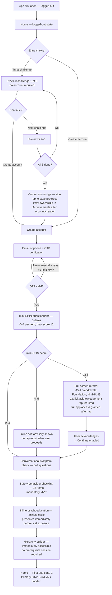
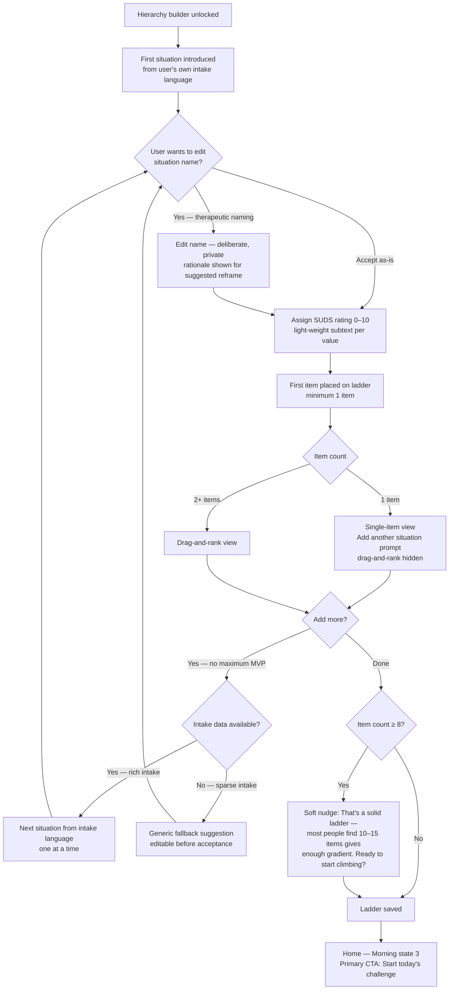
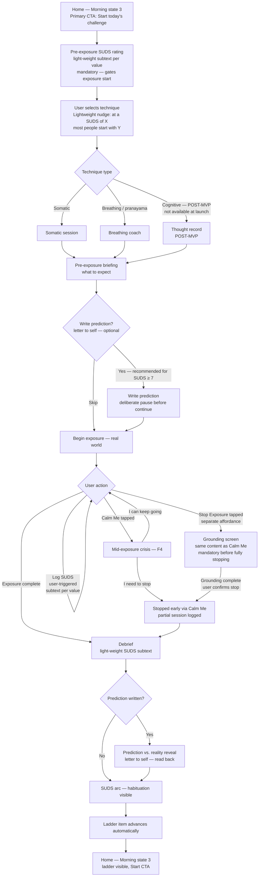
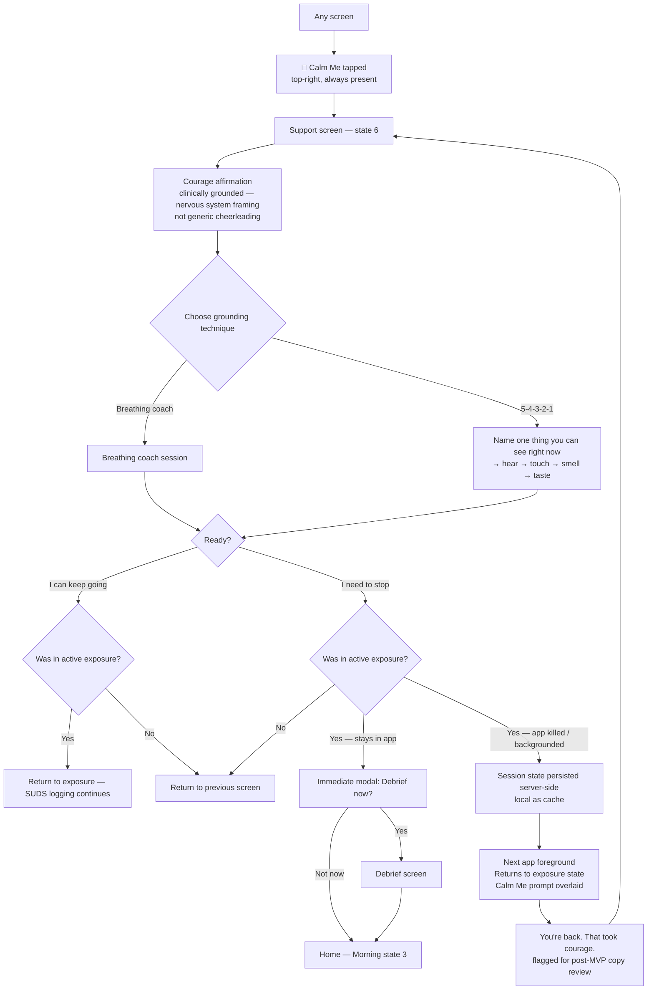
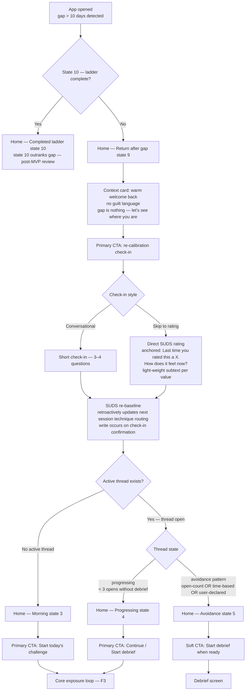

# User Journey Flows

Six critical flows covering all three MVP user journeys (JU-01, JU-03, JU-04) and all 10 home screen states.

## F1 — First-Use Onboarding

Entry: app store install. Covers cold open to hierarchy builder unlock.

**Decisions:**
- Anonymous previews stored in MMKV local storage only (no server-side anonymous record); completions transferred to the real account via `adapter.enqueue()` on account creation (ARC-005); anonymous progress is intentionally not retained across app reinstalls — a server-issued device token is not used (would create a pre-consent server record, violating DPDPA boundary, and would require network on cold first launch, violating offline-first design)
- Previews accessible from Achievements post-account creation
- OTP: no retry limit MVP; flagged for post-MVP review
- Safety behaviour checklist: mandatory MVP; flagged for post-MVP review
- **mini-SPIN (3-item, not 17-item SPIN):** Each item scored 0–4, max score 12. Three-tier response: score 0–3 → no message, proceed silently; score 4–5 → inline soft advisory shown inline, no tap required, user proceeds automatically; score ≥6 → full-screen referral (iCall, Vandrevala Foundation, NIMHANS contacts), explicit acknowledgement tap required before Continue is enabled; full app access granted at any score after acknowledgement. ≥6 threshold pending clinical sign-off for Indian urban adult wellness context.
- Referral screen contacts: iCall (+91-9152987821), Vandrevala Foundation (1860-2662-345), NIMHANS (080-46110007) — hardcoded strings, displayed offline
- SUDS scale everywhere: light-weight subtext shown dynamically as user selects each value, describing what it means
- **Readiness gate: REMOVED** — FR-GATE-01 was removed by product decision. The exposure hierarchy is immediately accessible after onboarding completes; no prerequisite thought record or somatic session is required.

---

## F2 — Fear Ladder Building

Entry: hierarchy builder accessible immediately after onboarding completes (no prerequisite).

**Decisions:**
- Situation name edit shows rationale for suggested reframe — not a silent correction
- SUDS: light-weight subtext per value on the 0–10 scale
- Minimum 1 item; drag-and-rank hidden with 1 item, single-item view shown
- Drag-and-rank from item 2 onwards; same view used for later edits outside builder
- No maximum ladder size MVP; post-MVP review
- Soft nudge at item 8: clinical framing, not cheerleading
- Commitment ritual: removed from MVP; deferred post-MVP

---

## F3 — Core Exposure Loop

Entry: home screen morning state (state 3). Primary daily therapeutic loop for all MVP journeys.

**Decisions:**
- Pre-exposure SUDS is mandatory and gates exposure start
- SUDS scale: light-weight subtext per value everywhere
- Technique routing: user-choice MVP with lightweight SUDS-based nudge ("at a SUDS of X, most people start with Y"); full clinical routing post-MVP
- **Cognitive technique (Thought Record) — POST-MVP:** FR-CBT-01/02/03 are deferred to post-MVP (backlog items 1.23–1.25). The Cognitive branch in this flow is not available at launch. MVP technique menu offers Somatic and Breathing/pranayama only. Thought Record option will be hidden or disabled in the technique picker until FR-CBT-01–03 are implemented.
- Letter to self: optional; framed as "recommended for SUDS ≥ 7" to encourage without forcing
- Two stopped-early paths: (1) Calm Me → "I need to stop" → immediate modal debrief offer; (2) Stop Exposure affordance → grounding screen (mandatory, not skippable) → user confirms stop → debrief
- SUDS logging during exposure: user-triggered; no minimum log count required; arc always has pre-exposure + debrief entry (two-point minimum)
- Ladder item advances automatically after debrief, unconditional on SUDS delta

---

## F4 — Mid-Exposure Crisis (SOS / Calm Me)

Entry: 🌊 Calm Me tapped from any screen. Maps to home screen state 6.

**Decisions:**
- Calm Me accessible from any screen — zero-navigation safety requirement; implemented as persistent overlay or global FAB (architecture decision, not UX assumption)
- Grounding prompt ("Name one thing you can see") shown only within 5-4-3-2-1, not as standalone
- Courage affirmation: clinically grounded nervous system framing ("Your nervous system is doing exactly what it's supposed to do") — not generic cheerleading
- Debrief offer after "I need to stop" is immediate modal, not a routed screen
- App kill mid-session: session state server-persisted (local as cache); re-entry returns to exposure state with Calm Me prompt overlaid — not state 6 directly; rationale documented to prevent future regression
- Re-entry copy: "You're back. That took courage." — flagged for post-MVP review

---

## F5 — Return After Gap / Re-engagement

Entry: app opened after gap > 10 days → home screen state 9.

**Decisions:**
- Gap threshold: 10 days (product decision; flagged for post-MVP review)
- State 10 (completed ladder) outranks state 9 (gap); post-MVP review
- Re-calibration: short conversational check-in OR skip to direct SUDS with anchoring line ("Last time you rated this a X")
- SUDS re-baseline write occurs on check-in confirmation, not on each input
- SUDS re-baseline retroactively affects next session's technique routing; audit trail required for post-MVP clinical routing
- Avoidance classification triggers on any of: (1) 3+ app opens on active thread without debrief; (2) thread open > 6 hours without debrief (provisional; post-MVP clinical review); (3) user explicitly declares they didn't complete
- "Avoidance" label never shown in UI; state 5 is tone-only
- **Avoidance state 5 — POST-MVP:** State 5 is fully specified here for design completeness but is explicitly deferred to post-MVP. Epic 6 Story 6.3 skips avoidance heuristic evaluation entirely; the state machine transitions directly from state 4 logic to state 6 logic with a required code comment `// State 5 (avoidance detection) deferred post-MVP`. All three classification thresholds also require post-MVP clinical review before going live (backlog item 1.1). Developers implementing Epic 6 must not implement state 5 based on this UX spec.
- **Daily SUDS check-in widget — POST-MVP:** FR-CHECKIN-01 (daily in-app check-in with technique routing) is not available at launch. The re-calibration check-in in this flow (node F/G/H/I/J) is a gap-return re-baseline only, not the recurring daily check-in described in FR-CHECKIN-01. The daily check-in widget on the home screen is deferred to post-MVP (backlog item 1.21) pending a complete somatic + CBT suite for clinically meaningful routing.

---

## F6 — DEFERRED

The 6-hour post-exposure reflection window and home states 7/8 were removed 2026-06-15 by Story 5.6 (Issue #36). Reflection capture happens entirely on the debrief screen (F3 node P). On debrief submit the user lands on home state 3 (ladder visible, Start CTA). See `_bmad-output/implementation-artifacts/5-6-remove-home-states-7-and-8.md` and `_bmad-output/planning-artifacts/adrs/ADR-HOME-STATE-RESOLVE.md` (Supersession block) for the full rationale.

---

## Longitudinal SUDS View

Accessible from the Achievements tab as a primary feature — not a post-debrief afterthought. Displays habituation curves across sessions: pre-exposure SUDS, in-session SUDS logs, debrief SUDS, trend across ladder items. Renders gracefully with irregular time series (user-triggered SUDS, 0–N points per session). Designed for all three user journeys but particularly load-bearing for JU-04 (post-therapy maintainer monitoring for relapse).

---

## Journey Patterns

**Single CTA per state:** Every home screen state resolves to one highlighted primary action. Appears across F1 (onboarding), F3 (loop), F5 (re-engagement). Reduces cognitive load at high-anxiety moments.

**Graceful degradation without data:** `suds_data_insufficient` fallback in routing, partial session preservation in F4, late debrief in F6, two-point arc minimum in F3. The app never punishes incomplete data — it falls to the safest available state and tries again.

**Re-entry, not restart:** App kill (F4), gap return (F5), expiry without debrief (F6) all return the user to their last meaningful state. Progress survives all interruptions.

**SUDS anchoring everywhere:** Light-weight subtext shown dynamically on every SUDS scale interaction — pre-exposure gate, in-session logging, re-calibration, debrief. Applies to all three MVP user journeys; especially important for first-time users (JU-01, JU-03) who have no prior reference point.

---

## Flow Optimization Principles

- **Zero-navigate safety:** Calm Me reachable from all screens; grounding never requires menu traversal
- **Prediction before exposure, reveal after:** Letter-to-self creates a deliberate emotional arc; the pause screen before continue is not negotiable; recommended framing for SUDS ≥ 7 encourages use without forcing
- **Server-authoritative time and state:** `expires_at`, session timestamps, open counts, and session state are never client-computed — removes DST, timezone, and clock-skew edge cases
- **State is recoverable:** No flow ends in an unrecoverable state; every dead-end has a defined re-entry path
- **Informed choice over managed choice:** User-choice technique selection with a contextual nudge preserves autonomy while reducing clinical risk; full algorithmic routing post-MVP
- **Offline resilience:** Calm Me and grounding techniques functional without network; session state server-persisted with local cache; degradation policy required before implementation (F3, F4 minimum)

---
