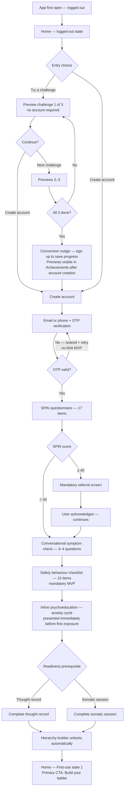
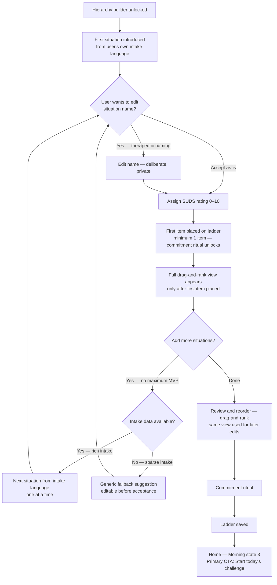
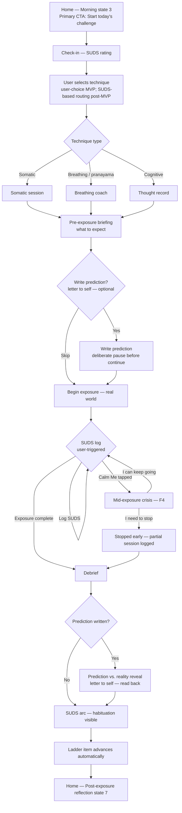
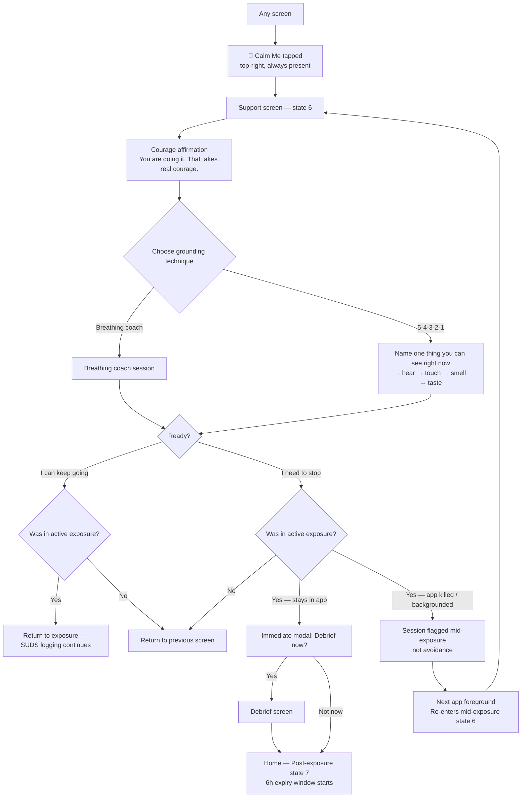
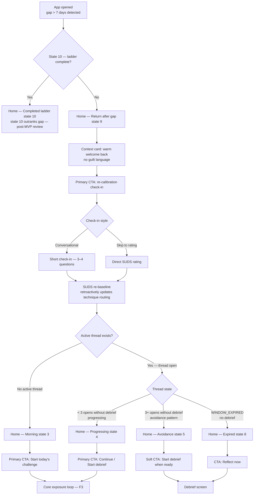
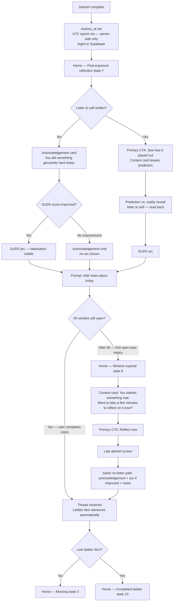

# UX Step 10 — User Journey Flows: Session Notes

**Status:** Party Mode review complete. 9 gaps + 1 ambiguity identified. Awaiting resolution before [C].

**Branch:** `docs/ux-design-step-10`

**Resume at:** Work through party mode gap list with Cooper, then select [C] to append flows to `ux-design-specification.md`.

---

## Six Flows — Final Locked Versions

### F1 — First-Use Onboarding

**Locked decisions:**
- Previews anonymous; completed previews persist in Achievements post-account creation
- OTP retry: no limit MVP; flagged for post-MVP review
- Safety behaviour checklist: mandatory MVP; flagged for post-MVP review
- SPIN ≥40: mandatory acknowledgement, not a block — user explicitly continues

---

### F2 — Fear Ladder Building

**Locked decisions:**
- Minimum 1 item to unlock commitment ritual
- Drag-and-rank view used for later edits outside the builder
- No maximum ladder size MVP; post-MVP review

---

### F3 — Core Exposure Loop

**Locked decisions:**
- Letter to self is optional
- Technique routing is user-choice MVP; SUDS-based routing post-MVP
- SUDS logging is user-triggered
- Stopped-early sessions reach debrief; partial session data preserved
- Ladder item advances automatically after debrief

---

### F4 — Mid-Exposure Crisis (SOS / Calm Me)

**Locked decisions:**
- Calm Me accessible from any screen — zero-navigation safety requirement
- Grounding prompt ("Name one thing you can see") shown only within 5-4-3-2-1, not as standalone
- Debrief offer after "I need to stop" is immediate modal, not routed screen
- App kill → re-enters mid-exposure state 6 on next foreground (not avoidance)

---

### F5 — Return After Gap / Re-engagement

**Locked decisions:**
- State 10 (completed ladder) outranks state 9 (gap) — flagged for post-MVP review
- Re-calibration is short conversational check-in with option to skip to direct SUDS
- SUDS re-baseline retroactively affects next session's technique routing
- 7-day gap threshold (product decision — needs explicit sign-off, see party mode below)

---

### F6 — Post-Exposure Reflection & Expiry

**Locked decisions:**
- Letter written → reveal is primary CTA
- No letter → acknowledgement card + SUDS arc if score improved + notes prompt
- No-letter path is first-class, not a fallback
- expires_at: UTC epoch ms, server-set at debrief completion, bigint in Supabase
- State 8 copy omits expiry reference — "You started something real"
- Late debrief offered indefinitely
- SUDS arc and reveal accessible post-thread from session history / ladder item detail
- Ladder advance is unconditional on debrief completion (needs explicit confirmation — see F6-GAP-2)

---

## Party Mode Review Findings

### Sally (UX) — Key Concerns

1. **F1 SPIN copy**: Referral acknowledgement tone is undefined — must feel like "we see you're carrying a lot," not a liability waiver. Copy needs to be written before spec locks.
2. **F2 no-max UX debt**: Soft friction nudge (around item 8–10) should be designed now even if no hard cap. Compulsive item-adding is a real avoidance pattern.
3. **F3 technique selection guardrail**: User-choice without guidance risks self-escalation. Even a single contextual nudge ("at a SUDS of 8, most people start here") would make the choice feel collaborative.
4. **F4 app-kill re-entry copy**: The emotional contract for re-entering state 6 after killing the app in distress is unwritten. Must be authored before spec locks.
5. **F5 skip-path anchor**: Direct SUDS without context is a number floating in space. A single anchoring line ("last time you rated this a 7") would solve it.
6. **F6 no-letter experience**: Must be designed as a first-class experience, not consolation prize. Some users will never write the letter.

### John (PM) — Key Concerns

1. **F1 preview count**: Why 3? No evidence cited. 1 may convert better; 3 may exhaust an anxious user.
2. **F1 SPIN acknowledgement purpose**: Liability shield or therapeutic intervention? If shield, own it. If intervention, a checkbox doesn't change behaviour.
3. **F2 no item cap**: Known avoidance behaviour. Soft cap at ~12 should be MVP, not post-MVP.
4. **F3 technique selection**: Clinical routing should be MVP, not post-MVP. User-choice bakes avoidance into the architecture.
5. **F4 mid-exposure state timeout**: No timeout defined for state 6 re-entry. User returns 3 hours later — state 6 may not reflect their reality.
6. **F5 7-day threshold**: Who set this and why? For weekly-exposure users, fires every session.
7. **F6 acknowledgement when abandoned early**: "You did something genuinely hard today" fires even after 30-second abandonment. Risk of reinforcing avoidance with warmth.

### Winston (Architect) — Key Concerns

1. **F1 anonymous persistence strategy**: Device token vs. local storage. Must decide before data model is specced.
2. **F1 SPIN "mandatory" precision**: Can the user lie or skip? If yes, mandatory is cosmetic. If no, requires legal review.
3. **F3 SUDS arc rendering**: Irregular time series (user-triggered). Chart component must handle 0–N data points gracefully.
4. **F3 session end paths**: 4 paths to debrief (natural, user stop, Calm Me stop, app kill) — different data completeness. Debrief and ladder advance logic needs to know which path was taken.
5. **F4 Calm Me mechanism**: "Any screen" is an architecture constraint — overlay, FAB, or deep-link. Each has trade-offs. Must be decided at architecture layer.
6. **F4 session state persistence**: App-kill re-entry requires durable session state write on session start or state transition. Local vs. server-side source of truth must be defined, especially for offline.
7. **F5 retroactive SUDS write**: Write must happen at a defined moment (confirmation, not on each input). Will need audit trail for post-MVP clinical routing.
8. **F6 expires_at clock start**: Server at session creation or at debrief completion? Delayed debrief could collapse the 6h window. Must be unambiguous.
9. **F6 state 8 trigger mechanism**: Client-side poll on foreground, local notification, or server push? Each has battery/reliability trade-offs.
10. **Cross-cutting offline**: No offline policy stated in any flow. F3 and F4 minimum need explicit degradation policy.

### Amelia (Engineer) — Gap List

| Flow | ID | Issue |
|------|-----|-------|
| F1 | `F1-GAP-1` | SPIN referral acknowledgement UI undefined — modal, screen, or checkbox? Dismiss behaviour undefined. Untestable. |
| F1 | `F1-GAP-2` | Preview → Achievements save trigger undefined. Per challenge or on account creation? Device cleared before account = achievements lost. |
| F2 | `F2-GAP-1` | Drag-and-rank with 1 item — a list of one has no rank. Guard state or component spec needed. |
| F3 | `F3-GAP-1` | Zero SUDS logs → flat arc at debrief. Is flat arc valid? Minimum log count before debrief unlocks: undefined. |
| F3 | `F3-GAP-2` | Stopped-early path — is F4 "I need to stop" the *only* route? If yes, state explicitly. If no, define the UI affordance. |
| F4 | `F4-GAP-1` | App-kill re-entry lands on state 6 (Calm Me), not the exposure. Intentional? If yes, document rationale or it will be "fixed." |
| F4 | `F4-AMB-1` | "Active" flag ownership — local or server-side? If local and process killed, flag is gone. Coupled with F4-GAP-1. |
| F5 | `F5-GAP-1` | "Avoidance" thread state classification trigger undefined — time-based? User-declared? Untestable without a trigger. |
| F6 | `F6-GAP-1` | expires_at UTC vs. local device display. Timezone-crossing mid-window not handled explicitly. Epoch authoritative: confirm and state. |
| F6 | `F6-GAP-2` | Ladder auto-advance on late debrief — is advance unconditional regardless of SUDS delta? Confirm. |

**Priority:** F4-GAP-1 + F4-AMB-1 (coupled, safety-critical) → F6-GAP-2 (core progression mechanic).

---

## What to Do at Resume

1. Work through the gap list with Cooper — resolve each item as a spec decision or defer with explicit rationale
2. Address John's three sharp questions: F3 routing rationale, F2 cap rationale, F5 7-day threshold ownership
3. Address Sally's two unwritten things: SPIN referral copy tone, F4 app-kill re-entry copy
4. Once gaps resolved → select [C] → append flows to `ux-design-specification.md`, update `stepsCompleted: [1..10]`, load step-11-component-strategy.md
